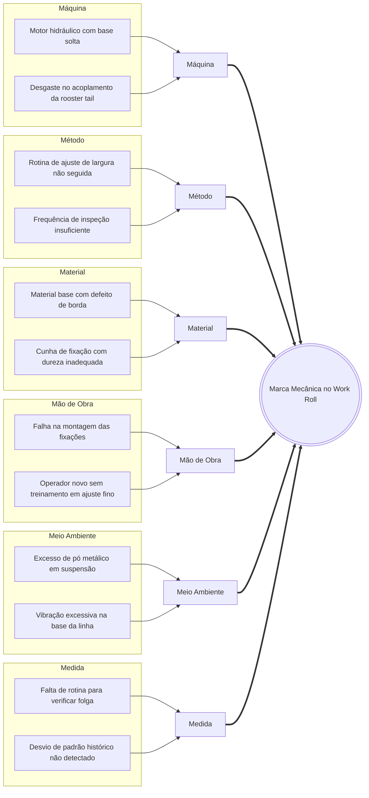

# Diagrama de Ishikawa (6M)

O Diagrama de Ishikawa (também conhecido como Diagrama de Espinha de Peixe ou Fishbone) é uma ferramenta visual de taxonomia de problemas. Organiza as causas raízes em categorias principais (6M), facilitando a identificação sistemática das origens de um incidente complexo na indústria.

## Taxonomia das Categorias (6M)

1. **Método (Method):** Processos, rotinas de ajuste, procedimentos operacionais padrão (SOPs), sequências de montagem e regras de operação.
2. **Máquina (Machine):** Equipamentos, ativos, motores hidráulicos, rolamentos, ferramentas de medição e sistemas de controle.
3. **Mão de obra (Manpower):** O fator humano. Nível de senioridade, treinamento técnico, fadiga do operador e erros de execução ou montagem.
4. **Material (Material):** Insumos de produção. Materiais vindos de processos anteriores, qualidade do óleo lubrificante, peças de reposição e componentes metálicos.
5. **Medição (Measurement):** Monitoramento e controle. Qualidade dos registros de manutenção, frequência de falhas históricas, calibração de instrumentos e dados de inspeções técnicas periódicas.
6. **Meio ambiente (Environment):** Condições do pavilhão industrial. Temperatura ambiente afetando viscosidade de óleos, vibrações externas, iluminação da área e umidade.

## Exemplo Real (Marca Mecânica em Cilindro de Laminação)

**Problema Central:** Aparecimento de marcas mecânicas repetitivas no cilindro Work Roll.

