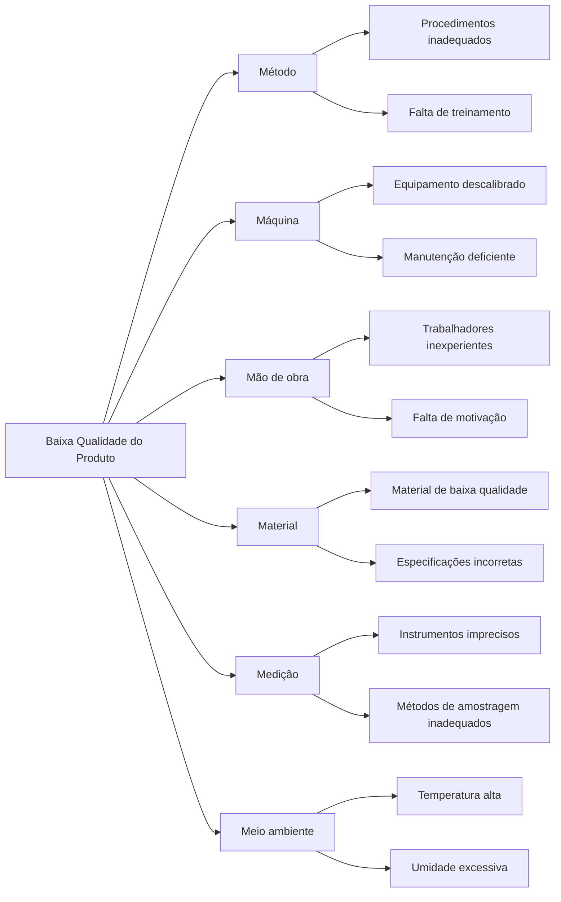

# Metodologia RCA

A Análise de Causa Raiz (RCA) é um processo sistemático para identificar as causas subjacentes de falhas.
Utilizamos os 5 Porquês e o Diagrama de Ishikawa (6M).

## 5 Porquês

O método dos 5 Porquês é uma técnica iterativa de questionamento usada para explorar as relações de causa e efeito subjacentes a um problema particular. O objetivo principal é determinar a causa raiz de um defeito ou problema, repetindo a pergunta "Por quê?".

### Como funciona

1. **Defina o problema claramente:** Comece com uma declaração clara e concisa do problema.
2. **Pergunte "Por quê?":** Pergunte por que o problema ocorreu.
3. **Responda e pergunte novamente:** Responda à pergunta e pergunte "Por quê?" novamente em relação à resposta.
4. **Continue até a causa raiz:** Repita o processo até que a causa raiz seja identificada. Geralmente, 5 iterações são suficientes, mas pode variar.
5. **Implemente soluções:** Uma vez identificada a causa raiz, implemente soluções para evitar que o problema ocorra novamente.

### Exemplo

**Problema:** A máquina parou de funcionar.

1. **Por que a máquina parou de funcionar?**
   - Porque o motor superaqueceu.
2. **Por que o motor superaqueceu?**
   - Porque o sistema de refrigeração não estava funcionando corretamente.
3. **Por que o sistema de refrigeração não estava funcionando corretamente?**
   - Porque o nível de refrigerante estava baixo.
4. **Por que o nível de refrigerante estava baixo?**
   - Porque houve um vazamento na mangueira.
5. **Por que houve um vazamento na mangueira?**
   - Porque a mangueira estava velha e desgastada.

**Causa raiz:** A mangueira estava velha e desgastada, levando ao superaquecimento do motor e à parada da máquina.

## Diagrama de Ishikawa (6M)

O Diagrama de Ishikawa, também conhecido como Diagrama de Causa e Efeito ou Diagrama de Espinha de Peixe, é uma ferramenta visual usada para identificar, explorar e exibir as possíveis causas de um problema específico. Ele organiza as causas em categorias principais, facilitando a identificação das causas mais prováveis.

### As 6 categorias principais (6M)

1. **Método:** Refere-se aos processos, procedimentos e métodos de trabalho utilizados. Inclui instruções de trabalho, procedimentos operacionais padrão, métodos de treinamento, etc.
2. **Máquina:** Refere-se aos equipamentos, ferramentas e máquinas utilizados no processo. Inclui manutenção, calibração, condição dos equipamentos, etc.
3. **Mão de obra:** Refere-se às pessoas envolvidas no processo. Inclui treinamento, experiência, fadiga, motivação, etc.
4. **Material:** Refere-se aos materiais utilizados no processo. Inclui qualidade dos materiais, especificações, fornecedores, etc.
5. **Medição:** Refere-se aos métodos de medição e inspeção utilizados. Inclui precisão dos instrumentos, métodos de amostragem, etc.
6. **Meio ambiente:** Refere-se ao ambiente em que o processo ocorre. Inclui temperatura, umidade, iluminação, ruído, etc.

### Como funciona

1. **Defina o problema claramente:** Escreva o problema na "cabeça do peixe" (lado direito do diagrama).
2. **Desenhe a espinha dorsal:** Desenhe uma linha horizontal apontando para o problema.
3. **Adicione as categorias principais:** Desenhe linhas diagonais (espinhas) saindo da espinha dorsal, cada uma representando uma das 6 categorias principais.
4. **Brainstorm de causas:** Para cada categoria, faça brainstorming de todas as possíveis causas que podem contribuir para o problema.
5. **Adicione subcausas:** Para cada causa principal, adicione subcausas que aprofundam a análise.
6. **Analise e priorize:** Analise o diagrama para identificar as causas mais prováveis e priorize-as para investigação adicional.

### Exemplo

**Problema:** Baixa qualidade do produto.

## Quando usar cada método

### Use 5 Porquês quando:

- O problema é relativamente simples e direto
- Você precisa de uma análise rápida e concisa
- Você quer identificar a causa raiz de um problema específico
- Você tem informações suficientes para responder às perguntas "Por quê?"

### Use Diagrama de Ishikawa quando:

- O problema é complexo e multifacetado
- Você precisa identificar todas as possíveis causas de um problema
- Você quer envolver uma equipe na análise do problema
- Você precisa de uma visão geral de todas as causas potenciais

## Dicas para uma análise eficaz

### Para 5 Porquês:

- Seja específico nas respostas
- Não aceite respostas superficiais
- Continue perguntando "Por quê?" até chegar à causa raiz
- Documente cada etapa do processo
- Envolva pessoas que têm conhecimento do problema

### Para Diagrama de Ishikawa:

- Envolva uma equipe diversificada
- Incentive o brainstorming livre
- Não critique ideias durante a geração
- Use dados e fatos para apoiar as causas identificadas
- Priorize as causas com base na probabilidade e impacto

## Conclusão

Os 5 Porquês e o Diagrama de Ishikawa são ferramentas poderosas para a análise de causa raiz. O método dos 5 Porquês é ideal para análises rápidas e focadas, enquanto o Diagrama de Ishikawa é melhor para problemas complexos que requerem uma análise mais abrangente. Ambos os métodos são complementares e podem ser usados juntos para obter uma compreensão completa das causas de um problema.
