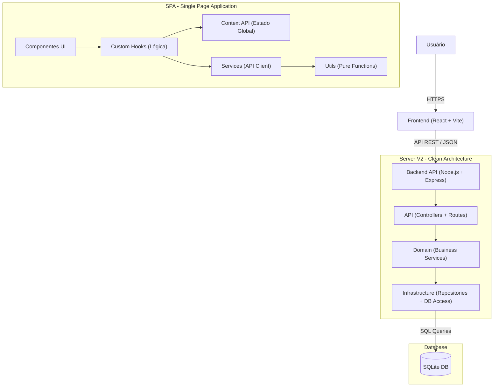

# Arquitetura Técnica - RCA System

## 1. Visão Geral

O **RCA System** é uma aplicação web moderna para **Gestão do Ciclo de Vida de Falhas (Failure Lifecycle Management)**, projetada para alta performance e escalabilidade global. A arquitetura segue o padrão **Monorepo** (Frontend e Backend no mesmo repositório), facilitando o compartilhamento de tipos e contratos de API, embora as implementações sejam logicamente separadas.

### Principais Objetivos da Arquitetura
- **Performance de UI (Zero Lag):** Renderização otimizada para grandes volumes de dados.
- **Integridade de Dados:** Validação rigorosa em ambas as pontas (Client e Server) via Schemas compartilhados.
- **Manutenibilidade:** Separação clara de responsabilidades (Clean Architecture no Backend, Component-Service no Frontend).
- **Portabilidade:** Backend leve e banco de dados embarcado (SQLite) para fácil deployment e operação em ambientes industriais (Edge).

---

## 2. Diagrama de Arquitetura

---

## 3. Frontend (Camada de Apresentação)

O Frontend foi construído utilizando **React 19** e **Vite**, focado na experiência do usuário e performance extrema (O(1) rendering para listas).

### 3.1 Tecnologias Chave
- **Linguagem:** TypeScript (Tipagem estrita para segurança em tempo de compilação).
- **Framework:** React 19 (Component-based architecture).
- **Build Tool:** Vite (Hot Module Replacement instantâneo).
- **Estilização:** Tailwind CSS v4 (Utility-first, design system consistente).
- **Gerenciamento de Estado:** React Context API + Hooks customizados para estados complexos.
- **Biblioteca de UI:** Lucide React (Ícones), Recharts (Visualização de Dados).

### 3.2 Estrutura de Diretórios (`src/`)
A organização do código frontend segue uma estrutura modular baseada em responsabilidades:

- **/components:** Componentes visuais puramente de apresentação. Devem ser agnósticos à lógica de negócios complexa.
- **/hooks:** Encapsulam a lógica de negócios, chamadas de API (via services) e efeitos colaterais. Os componentes consomem estes hooks.
- **/context:** Provedores de estado global (ex: Tema, Autenticação, Dados Mestres, i18n).
- **/services:** Camada de serviço responsável por isolar a comunicação com o Backend. Contém métodos para GET, POST, PUT, DELETE, tratando erros HTTP.
- **/utils:** Funções auxiliares puras, sem estado, para formatação de dados, cálculos matemáticos, etc.
- **/i18n:** Configurações de internacionalização e arquivos de tradução (locales).

### 3.3 Estratégias de Performance
- **Virtualização:** Uso intensivo de `react-window` para listagens longas (Triggers), garantindo que apenas os itens visíveis sejam renderizados no DOM, mantendo a UI fluida mesmo com milhares de registros.
- **Memoização:** Uso criterioso de `useMemo` e `React.memo` para evitar re-renderizações desnecessárias em componentes pesados ou frequentemente atualizados.
- **Lazy Loading:** Carregamento sob demanda de módulos ou rotas menos utilizadas (se aplicável).

---

## 4. Backend (Camada de Aplicação)

O Backend reside em `server/` e utiliza **Node.js** com **Express**. A arquitetura da versão 2 (`src/api/v2`) foi refatorada para seguir princípios de **Domain-Driven Design (DDD)** simplificado e **Clean Architecture**.

### 4.1 Tecnologias Chave
- **Runtime:** Node.js (V8 Engine).
- **Framework Web:** Express (Minimalista e robusto).
- **Linguagem:** TypeScript.
- **Validação:** Zod (Parse e validação de input runtime).

### 4.2 Arquitetura em Camadas (`server/src/v2`)
A separação em camadas garante que a lógica de negócios não dependa de detalhes de implementação (como o banco de dados ou o framework HTTP).

1.  **API (`/api`):**
    - **Controllers:** Recebem as requisições HTTP, extraem parâmetros e body.
    - **Routes:** Mapeiam URLs para controllers.
    - **Schemas:** Definições Zod para validar a entrada. Se a validação falhar, retorna erro 400 antes de atingir o domínio.
    - **Responsabilidade:** Apenas transporte e validação de contrato.

2.  **Domain (`/domain`):**
    - **Services:** Implementam os casos de uso e regras de negócio "core" (ex: cálculo automátio de status da RCA, validação de transições de estado, regras de negócio complexas).
    - **Entities:** Representação dos objetos de negócio.
    - **Responsabilidade:** Garantir a consistência das regras de negócio.

3.  **Infrastructure (`/infrastructure`):**
    - **Repositories:** Implementam a persistência de dados. Abstraem o acesso ao banco.
    - **Database Connection:** Gerencia a conexão com o SQLite.
    - **Responsabilidade:** Persistir e recuperar dados.

---

## 5. Dados e Persistência

O sistema utiliza **SQLite** como banco de dados relacional (RDBMS). Esta escolha prioriza a simplicidade de operação ("serverless" database), portabilidade e performance local. Atualmente, a camada de acesso a dados é específica para SQLite (ver **Issue #40** para planos de abstração).

- **Abstração:** O acesso ao banco é encapsulado nos Repositórios da camada de infraestrutura.
- **Schema:** O esquema do banco reflete as entidades principais do domínio: `Triggers`, `RCAs`, `Actions` (Planos de Ação) e tabelas auxiliares.
- **Migrações:** (Verificar ferramenta de migração utilizada, se aplicável, ou scripts SQL diretos).

---

## 6. Fluxo de Dados e Segurança

### 6.1 Validação (Zod)
A integridade dos dados é garantida pelo uso extensivo da biblioteca **Zod**. Schemas de validação são a primeira linha de defesa.
- **Frontend:** Valida formulários e inputs do usuário antes do envio para a API, proporcionando feedback imediato.
- **Backend:** Valida rigorosamente todo payload recebido na camada de API. Dados inválidos são rejeitados antes de qualquer processamento de negócio.

### 6.2 Internacionalização (i18n)
O sistema foi desenhado para escalabilidade (Multi-Manufatura).
- **Frontend:** A interface utiliza uma solução customizada (`LanguageContext`) para traduzir labels e mensagens. **Nota:** Atualmente, algumas traduções podem estar "hardcoded" ou em dicionários locais (Dívida Técnica).
- **Dados:** O Backend armazena, idealmente, chaves ou códigos neutros para dados categóricos (ex: Status 'IN_PROGRESS' ao invés de 'Em Andamento'), delegando a tradução de "display values" para a camada de apresentação.

---

## 7. Padrões de Código e Qualidade

O projeto segue diretrizes estritas de desenvolvimento definidas em `docs/CODE_GUIDELINES.md`:

- **Padronização:** ESLint e Prettier para garantir consistência de estilo.
- **Commits:** Padrão Conventional Commits obrigatório (`feat:`, `fix:`, `docs:`, `refactor:`).
- **Testes:**
    - **Unitários:** Vitest para testar lógica de negócios e componentes isolados.
    - **E2E:** Playwright para validar fluxos críticos de usuário (smoke tests e regressão).
- **Revisão de Código:** Pull Requests obrigatórios com CI checks (Build, Lint, Test) passando antes do merge.

---

> **Nota:** Este documento deve ser mantido vivo e atualizado conforme a arquitetura evolui. Qualquer decisão arquitetural significativa deve ser refletida aqui.

---

## 📚 Documentação Relacionada
- [Visão Geral do Produto (PRD)](./PRD.md)
- [Regras de Negócio](./BUSINESS_RULES.md)
- [Referência da API](./API_REFERENCE.md)
- [Diretrizes de Código](./CODE_GUIDELINES.md)
- [Design System](./DESIGN_SYSTEM.md)
- [Guia de Testes](./TESTING.md)
- [Catálogo de Testes](./TEST_CATALOG.md)

---

> **Nota de Manutenção:** Mantenha este documento atualizado. Mudanças arquiteturais devem ser refletidas aqui e validadas contra o [PRD](./PRD.md).
