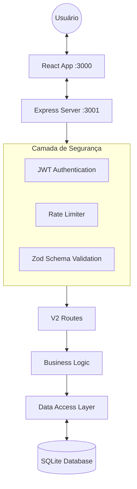

# 📘 Documentação Técnica: Global RCA System

## 1. Arquitetura do Sistema

O Global RCA System utiliza uma arquitetura **Hexagonal (Ports & Adapters)** no backend para garantir testabilidade e independência de infraestrutura, com um frontend React focado em alta performance ("Zero Lag Rendering").

### Visão Geral dos Componentes
- **Frontend:** React 18/19, Vite, Tailwind CSS, Context API.
- **Backend:** Node.js, Express, TypeScript.
- **Banco de Dados:** SQLite (via `sql.js` para persistência local e portabilidade).
- **Protocolo de Comunicação:** RESTful API com payloads JSON.

### Diagrama de Fluxo


---

## 2. Especificações de API

### Autenticação (OAuth2/JWT)
Atualmente em fase de implementação. O padrão definido é:
- **Tipo:** Bearer Token (JWT).
- **Header:** `Authorization: Bearer <token>`
- **Expiração:** 8 horas para tokens de acesso.
- **Refresh:** Implementação futura de Refresh Tokens.

### Endpoints Principais (V2)

| Método | Endpoint | Descrição | Status Codes |
| :--- | :--- | :--- | :--- |
| `GET` | `/api/rcas` | Lista todos os registros de RCA. | 200, 401 |
| `POST` | `/api/rcas` | Cria um novo RCA (Inicia ciclo 6M). | 201, 400, 401 |
| `GET` | `/api/assets` | Lista ativos para seleção. | 200 |
| `GET` | `/api/actions` | Lista planos de ação vinculados. | 200 |
| `GET` | `/api/health` | Status de saúde do sistema. | 200 |

#### Exemplo de Payload (POST /api/rcas)
**Request:**
```json
{
  "title": "Falha Crítica Motor Principal",
  "asset_id": "ASSET-123",
  "ishikawa": {
    "machine": ["Vibração excessiva"],
    "method": ["Falta de calibração"]
  }
}
```

**Response (201 Created):**
```json
{
  "id": "uuid-v4-string",
  "message": "RCA created successfully",
  "status": "STATUS-01"
}
```

---

## 3. Modelo de Dados (ERD)

O esquema do banco de dados foca na rastreabilidade entre Gatilhos -> Análises -> Ações.

| Tabela | Campos Chave | Relações |
| :--- | :--- | :--- |
| **rcas** | `id`, `title`, `ishikawa_json` | FK para assets |
| **assets** | `id`, `name`, `hierarchy_path` | - |
| **action_plans** | `id`, `rca_id`, `description`, `due_date` | FK para rcas |
| **triggers** | `id`, `condition`, `source` | - |

### Restrições e Índices
- **ID:** UUID v4 em todas as tabelas primárias.
- **Índice:** `idx_rcas_asset_id` para otimização de buscas por equipamento.

---

## 4. Guia de Contribuição

### Setup do Ambiente
1. Certifique-se de ter o **Node.js 18+** instalado.
2. Clone o repositório.
3. Execute `npm install` na raiz e em `/server`.
4. Variáveis de Ambiente: Copie `.env.example` para `.env`.

### Fluxo Git
- Utilize o padrão **Git Flow** simplificado.
- Ramificações: `main` (produção), `develop` (integração), `feature/*` (novas funcionalidades).
- Commits: [Conventional Commits](https://www.conventionalcommits.org/).

### Qualidade de Código
- **Linting:** `npm run lint`
- **Formatação:** Prettier (automático via VSCode ou `npm run format`).
- **Testes:** 
  - Unitários: `npm run test`
  - E2E: `npx playwright test`

---

## 5. Segurança da API (OWASP Guidelines)

Para garantir a proteção dos dados operacionais, o projeto segue as diretrizes **OWASP 2025**:

1. **Validação de Entrada:** Nenhum dado do cliente é confiado. Uso de `Zod` para sanitização.
2. **Prevenção de Injeção:** Queries parametrizadas em todas as interações com SQLite.
3. **Gestão de Segredos:** Tokens e chaves nunca são versionados (usar secret management da nuvem ou `.env` protegido).
4. **Logs e Auditoria:** Todas as alterações em RCAs devem ser logadas com `user_id` e `timestamp`.

---

## 6. Métricas de Sucesso

- **Cobertura OpenAPI:** 100% dos endpoints documentados.
- **Taxa de Aprovação de PRs:** > 90% na primeira revisão.
- **Segurança:** Zero incidentes de acesso não autorizado em auditorias mensais.
- **Performance:** Resposta da API < 200ms para 95% das requisições de leitura.
