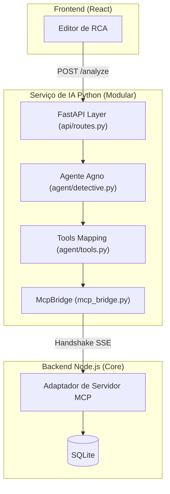
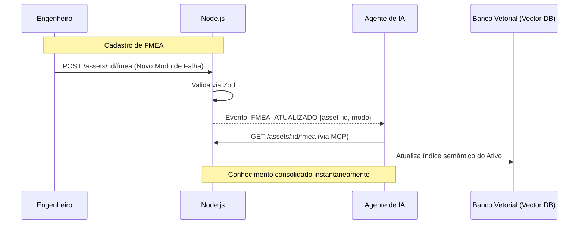

# AI Technical Design: Agente RCA Detective

Este documento define o **"Como"** e o **"Porquê"** da integração técnica da IA no RCA System, seguindo as diretrizes de Clean Architecture, performance "Zero Lag" e escalabilidade industrial.

---

## 1. Padrão de Comunicação: **MCP + REST Proxy**

Para evitar o acoplamento excessivo e a duplicação de lógica de negócios (Split Brain), utilizaremos um modelo híbrido onde o Backend (Node.js) atua como um **MCP Server**.

### 1.1 Interface MCP (Specification)

O Backend exporá as seguintes capacidades para o Agente Agno:

| Tipo | Nome | Parâmetros | Descrição |
| :--- | :--- | :--- | :--- |
| **Tool** | `get_rca_context` | `id: string` | Retorna o JSON completo de uma RCA, incluindo status calculado e 5W. |
| **Tool** | `search_technical_taxonomy` | `query: string` | Consulta a árvore de ativos e modos de falha padronizados. |
| **Tool** | `get_asset_fmea` | `asset_id: string` | Recupera os modos de falha previstos no FMEA para o ativo específico. |
| **Resource** | `rca://history/last-30-days` | - | Stream de dados resumidos das últimas análises para contexto rápido. |
| **Prompt** | `analyze-recurrence-template` | `equipment_id` | Template pré-definido de sistema para análise de similaridade. |

> **Por que MCP?**
> Standard 2025 para agentes. O Agno pode "descobrir" ferramentas dinamicamente. Se adicionarmos uma nova regra de negócio no Node.js (ex: validação de custo de reparo), basta expor via MCP e a IA passará a considerá-la sem novos deploys no serviço Python.

---

## 2. Arquitetura do Sistema (Layers)

A arquitetura do microserviço Python foi desenhada para separar o protocolo de comunicação (MCP) da inteligência do agente e da interface API.

### 2.1 Visão Geral das Camadas
A separação segue o princípio de que a IA é um **agente externo especializado**, orquestrado pelo framework **Agno (antiga Phidata)**.

### 2.2 Estrutura Modular Interna
- **Módulo Agente (`agent/`)**: Encapsula a "personalidade" do RCA Detective. Utiliza o modelo `gemini-2.0-flash` e mapeia ferramentas que invocam o MCP.
- **Módulo API (`api/`)**: Define o contrato REST entre o sistema principal e a IA, garantindo tipagem forte com Pydantic.
- **Ponte MCP (`mcp_bridge.py`)**: Gerencia o estado da sessão SSE. O uso de um padrão Singleton/ClassMethod garante que a sessão seja reutilizada entre requisições.

---

## 3. Fluxos de Dados Detalhados

### 3.1 Fluxo de Inferência (Sugestão de Causa Raiz)
Este fluxo ocorre quando o usuário solicita assistência na UI.

1.  **Request:** Usuário clica em "Assistir". O Frontend envia a descrição atual para o serviço de IA.
2.  **Contextualização:** O Agente Python chama `get_asset_fmea` via MCP para entender o que é "teoricamente possível" falhar.
3.  **Memória:** O Agente consulta seu Vector DB interno para buscar falhas similares que já *ocorreram*.
4.  **Raciocínio:** O LLM cruza FMEA + Histórico + Descrição Atual.
5.  **Response:** Retorna sugestões estruturadas (Causa, Ishikawa, Ação).

### 3.2 Sincronização de Triggers e FMEA
Garante que a IA esteja sempre atualizada com as configurações da planta.

---

## 4. Gestão de Memória (Vector Store Lifecycle)

- **Embeddings:** Utilizaremos `text-embedding-3-small` (OpenAI) ou `nomic-embed-text` (Local).
- **Chunking:** As RCAs serão divididas em: *Descrição do Fenômeno*, *Análise 5W* e *Ações*. Isso permite buscas granulares ("Mostre ações para motores queimados" vs "Mostre causas para barulho excessivo").
- **Persistence:** O ChromaDB rodará em volume persistente no Docker, isolado dos dados relacionais.

---

## 5. Racional Técnico

1.  **Node.js como 'Single Source of Truth':** Toda validação reside no Node.js. A IA não escreve direto no SQL, ela propõe mudanças que o usuário deve salvar via API padrão.
2.  **Agno para Agilidade:** O uso de Python permite iterar rapidamente em novos modelos de LLM. Iniciaremos com **Google Gemini API** para prototipagem rápida e migraremos para **Azure OpenAI Service** para a implementação final em produção, garantindo conformidade corporativa.
3.  **Performance Zero Lag:** As consultas pesadas de similaridade (Vetoriais) rodam no serviço Python, mantendo o loop de eventos do Node.js livre para as operações críticas da fábrica.
4.  **Segurança e Auditoria:** O fluxo via MCP/REST permite logar exatamente o que a IA leu para gerar uma sugestão, essencial para conformidade industrial.
