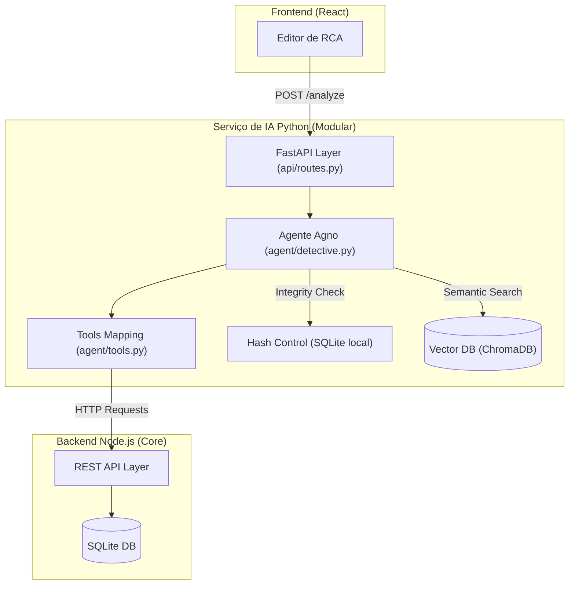

# AI Technical Design: Agente RCA Detective

Este documento define o **"Como"** e o **"Porquê"** da integração técnica da IA no RCA System, seguindo as diretrizes de Clean Architecture, performance "Zero Lag" e otimização de custos (Fevereiro 2026).

---

## 1. Padrão de Comunicação: **REST-First (Domain Integration)**

Originalmente planejado via MCP (SSE), o sistema migrou para um modelo **REST direto** para garantir máxima estabilidade e eliminar *deadlocks* no ciclo de vida do serviço. O Backend (Node.js) atua como o **Single Source of Truth**.

### 1.1 Interface de Ferramentas (Tools)

O Agente Agno consome endpoints REST do Backend para contextualizar suas análises:

| Nome da Tool | Endpoint REST | Descrição |
| :--- | :--- | :--- |
| `get_rca_context` | `GET /rcas/:id` | Retorna o JSON completo da análise atual. |
| `get_asset_fmea` | `GET /assets/:id/fmea` | Recupera modos de falha previstos no catálogo técnico. |
| `query_rca_history` | `Internal (RAG)` | Busca semântica no banco vetorial local. |

---

## 2. Arquitetura do Sistema (Layers)

A arquitetura do microserviço Python separa a inteligência (Agno) da gestão de dados e interface (FastAPI).

### 2.1 Visão Geral das Camadas

### 2.2 Busca Hierárquica de Recorrências (Fase 3)

O sistema realiza uma busca semântica recursiva no ChromaDB para identificar falhas similares, respeitando a árvore de ativos:
1.  **Nível 1 (Subgrupo):** Busca rca_id com o mesmo `subgroup_id`.
2.  **Nível 2 (Equipamento):** Se não houver reincidência no subgrupo, busca no `equipment_id`.
3.  **Nível 3 (Área):** Como última instância, busca na `area_id`.

Este fluxo garante que a IA identifique se o problema é isolado em um componente ou sistêmico na área.

### 2.3 Priorização de Contexto (Novas RCAs)

Para garantir que a IA analise RCAs que ainda não foram salvas no banco de dados, implementamos um fluxo de **Context-First**:
- O frontend envia o estado atual do formulário via `JSON.stringify` no campo `context`.
- O backend extrai `title`, `description` e `asset_display` deste JSON.
- O Agente prioriza estas informações sobre qualquer dado histórico, permitindo análises preditivas em rascunhos.

### 2.4 Deep Linking via Hash

Para permitir a navegação fluida entre recorrências sem perder o estado do editor principal:
- **Padrão:** `#/rca/:id`
- **Listener:** O `App.tsx` monitora mudanças no `window.location.hash`.
- **Ação:** Ao detectar o padrão, o sistema busca o registro completo e abre o `RcaEditor` instantaneamente em uma nova instância ou aba.

### 2.5 Controle de Hashes (Cost Optimization)
Para economizar créditos da API Google Gemini Embeddings, implementamos um sistema de **Hash Control**:
- **Banco local**: `data/rca_knowledge.db` (SQLite).
- **Lógica**: Antes de re-indexar uma RCA histórica, o sistema gera um hash SHA-256 do seu conteúdo. Se o hash for idêntico ao salvo, o processo de embedding é ignorado (Skip).

---

## 3. Gestão de RAG (Retrieval-Augmented Generation)

O conhecimento da IA é alimentado por dois fluxos:

1.  **Estático**: Documentações técnicas em Markdown localizadas em `data/knowledge/`.
2.  **Dinâmico (Sync)**: Sincronização em background de todas as RCAs concluídas no sistema principal.

- **Vector DB:** ChromaDB operando em modo `persistent_client=True`.
- **Embedder:** Google Gemini Embeddings (via API).

---

## 4. Racional Técnico

1.  **Desacoplamento por Microsserviço:** O processamento pesado de vetores e análise de linguagem ocorre em Python, mantendo o Node.js focado em regras de negócio e persistência relacional.
- **Módulo Agente (`agent/`)**: Encapsula a "personalidade" do RCA Detective. Implementa a persona de **Especialista Sênior em Engenharia de Confiabilidade**, com foco em 5 Porquês e Ishikawa, evitando vazamento de nomes de funções internas do sistema.
- **Módulo API (`api/`)**: Define o contrato REST entre o sistema principal e a IA, garantindo tipagem forte com Pydantic.
3.  **Segurança Interna:** Todas as chamadas entre o Node.js e o AI Service são protegidas por uma `INTERNAL_AUTH_KEY` nos headers.
4.  **Resiliência Industrial:** A inicialização da IA ocorre em threads de background, garantindo que o serviço suba mesmo se a conexão com as ferramentas de domínio falhar temporariamente.

---
*Documentação atualizada após Milestone da Fase 2.*
