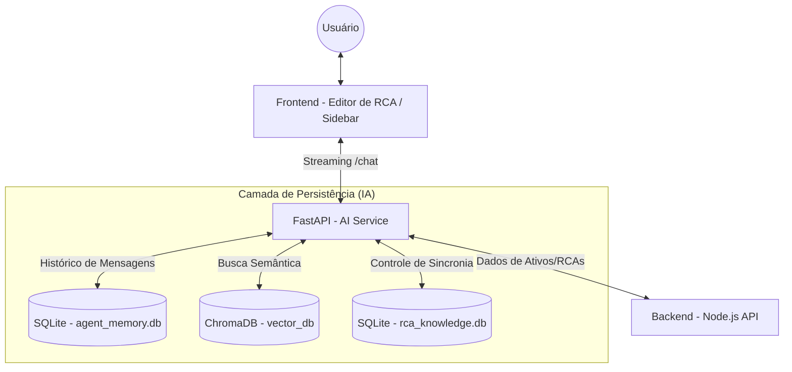
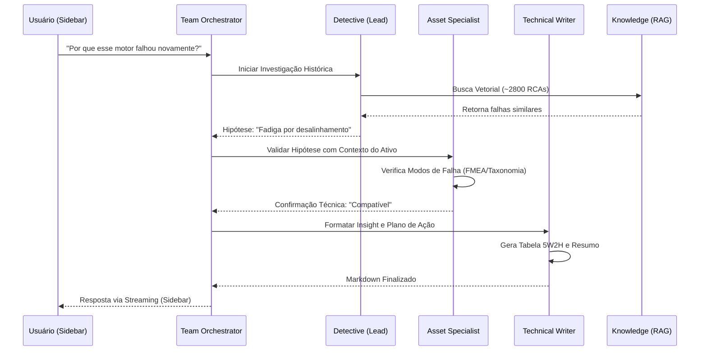

# Design Técnico: Evolução Multi-Agente (Fase 4.5)

Este documento detalha a arquitetura do time de agentes **RCA-Detectives**, focando em especialização, memória persistente e fluxos de trabalho estruturados usando o framework **Agno**.

---

## 1. Arquitetura de Agentes (Teams)

Em vez de um único agente "faz-tudo", utilizaremos um **Team** de especialistas coordenados por um Lead Agent.

### A. Detective Agent (Lead Investigator)
- **Papel**: Coordenar a investigação inicial e buscar similaridades históricas.
- **Capacidades (Skills/Tools)**:
    - RAG Dinâmico: Busca na base de ~2800 RCAs históricas.
    - DuckDuckGo: Pesquisa externa de manuais e normas técnicas (se necessário).
    - Recurrence Scanner: Lógica de similaridade hierárquica.
- **Reasoning**: Loop de reflexão interno para validar se uma recorrência é real antes de afirmar.

### B. Asset Specialist (Consultant)
- **Papel**: Especialista no contexto do ativo atual.
- **Capacidades (Skills/Tools)**:
    - Context Fetcher: Busca detalhes técnicos do ativo via Backend API.
    - FMEA Placeholder: Estrutura preparada para receber dados de modos de falha (FMEA) no futuro.
- **Foco**: Validar se a hipótese do Detective é compatível com a física do equipamento.

### C. Technical Writer (Action Planner)
- **Papel**: Redator técnico focado em resultados acionáveis.
- **Capacidades (Skills/Tools)**:
    - 5W2H Architect: Geração de tabelas de planos de ação.
    - Markdown Styler: Formatação rica para relatórios executivos.
- **Foco**: Clareza, objetividade e pragmatismo nas recomendações.

---

## 2. Contexto Obrigatório (Mandatory Info)

Para qualquer análise (nova ou existente), os agentes DEVEM ter acesso garantido a:
- **Subgrupo ID**: Para contextualização técnica e similaridade.
- **Título Curto (O Que)**: Para definição rápida do problema.

Estes dados serão injetados sistematicamente em cada chamada ao time para garantir precisão desde a "Fase de Descoberta".

---

## 3. Interface: Sidebar Copilot (Right Panel)

A experiência de usuário evolui de um modal bloqueante para uma barra lateral (estilo Edge Copilot) integrada ao editor de RCA.

### A. Sidebar Não-Bloqueante
- **Posicionamento**: Fixa à direita da tela.
- **Interação Simultânea**: O usuário pode editar o formulário da RCA enquanto consulta a IA. 
- **Injeção de Dados**: Botões "Aplicar Sugestão" na Sidebar preenchem automaticamente os campos do formulário principal sem fechar o chat.

### B. Chat Estilo GPT (Conversa Contínua)
- **Histórico Persistente**: A conversa não "reseta" a cada interação. O agente mantém o fio da discussão usando a memória vinculada ao `rca_id`.
- **Streaming de Respostas**: Respostas rápidas e progressivas via SSE (Server-Sent Events).

---

## 4. Workflow de Análise Estruturado

Para evitar o comportamento de "disparo único", o sistema seguirá um workflow de estados definido no Agno:

1.  **Fase de Descoberta (Discovery)**: O Detective varre o backend e o RAG. Se dados críticos (como o Ativo) estiverem ausentes, o agente **para** e pergunta ao usuário no chat: "Poderia informar qual o modelo do motor?".
2.  **Fase de Raciocínio (Reasoning)**: Com os dados em mãos, o Specialist cruza com a taxonomia e FMEA. O usuário pode intervir com observações de campo em tempo real.
3.  **Fase de Resposta (Drafting)**: O Writer consolida o relatório. O histórico de mensagens permite que o usuário peça ajustes finos: "Refaça o 5W2H focando apenas na parte mecânica".

---

## 5. Estrutura de Comunicação (Streaming)

Para garantir uma UX "viva", utilizaremos o **Streaming do Agno** via `arun(stream=True)`.
- O Frontend (React) consome o stream via Server-Sent Events (SSE).
- O backend retorna blocos de Markdown que a Sidebar renderiza progressivamente.

As `Skills` são funções Python encapsuladas que garantem precisão lógica que o LLM sozinho pode falhar.

- **`RecurrenceAnalysisSkill`**: Calcula scores de similaridade e identifica se a falha é recorrente no Subgrupo, Equipamento ou Área.
- **`ActionValidationSkill`**: Verifica se as ações propostas seguem a hierarquia de controle (Eliminação > Substituição > Engenharia > Administrativo > EPI).
- **`VisualDiagnosticSkill` (Fase 5)**: Placeholder para processamento de imagens via Vision (Gemini Multimodal).

---

## 6. Memória e Persistência (SQLite)

Utilizaremos o `SqliteMemory` para garantir que o agente não "esqueça" o contexto entre sessões.

- **Storage**: `data/agent_memory.db` (SQLite).
- **Session ID**: Mapeado diretamente para o `rca_id`.
- **User ID**: Mapeado para o usuário logado na plataforma.
- **Benefício**: Se dois usuários diferentes editarem a mesma RCA, o agente terá o contexto compartilhado da investigação.

## 7. Fluxos de Dados e Interação (Mermaid)

### A. Fluxo de Bancos de Dados (Data Architecture)
Este diagrama mostra como o serviço de IA interage com as diferentes fontes de dados e persistência.



### B. Fluxo do Time de Agentes (Team Workflow)
Este diagrama ilustra a colaboração entre os especialistas para gerar um insight de alta qualidade.



---

## 8. Estrutura de Pastas (Refatoração Modular)

Para suportar essa complexidade, a pasta `ai_service` será organizada assim:

```text
ai_service/
├── agent/
│   ├── teams/
│   │   ├── lead_detective.py     # Definição do Detective
│   │   ├── asset_specialist.py   # Definição do Asset Specialist
│   │   └── tech_writer.py        # Definição do Technical Writer
│   ├── skills/
│   │   ├── recurrence.py         # Lógica de similaridade
│   │   └── actions.py            # Lógica de validação de ações
│   ├── knowledge.py              # Configuração do RAG (ChromaDB)
│   ├── memory.py                 # Configuração da Memória (SQLite)
│   ├── prompts.py                # Instruções das Personas
│   └── tools.py                  # Ferramentas de API (Backend)
├── api/
│   ├── routes.py                 # Endpoints FastAPI
│   └── models.py                 # Pydantic Models
├── data/
│   ├── vector_db/                # ChromaDB (Persistente)
│   ├── agent_memory.db           # SQLite (Histórico de chats)
│   └── rca_knowledge.db          # SQLite (Controle de Hashes)
├── main.py                       # Ponto de entrada (FastAPI + AgentOS)
└── config.py                     # Variáveis de ambiente
```

---

## 9. Próximos Passos de Implementação (Sprint 4.5)

1.  [x] Criar o banco de dados `agent_memory.db` via SqliteStorage.
2.  [x] Desmembrar o agente atual em 3 instâncias especialistas.
3.  [x] Implementar a orquestração via `Team` (Base do Copilot).
4.  [ ] Realizar o Mockup e Implementação da **Sidebar UX (Painel Direito)** no Editor de RCA.
5.  [ ] Projetar a classe `AnalysisWorkflow` para gerenciar os estados (Discovery, Reasoning, Drafting).
6.  [ ] Ajustar o Backend para garantir a injeção do **Contexto Obrigatório** (Subgrupo, Título).
7.  [ ] Implementar a lógica de **Chat Contínuo** (GPT-style) mantendo o histórico da sessão.
8.  [ ] Adicionar botões de **Injeção de Dados** ("Aplicar Sugestão") para preenchimento automático do formulário.
