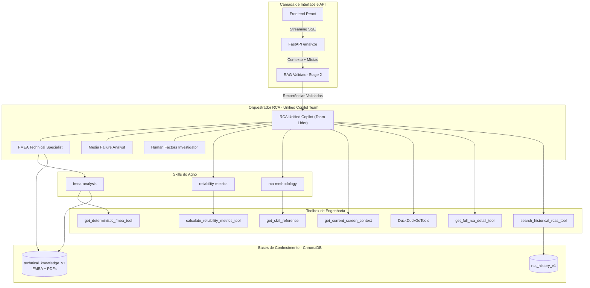

# Arquitetura do AI Service - Orquestração de Especialistas

Esta documentação descreve o funcionamento do módulo de Inteligência Artificial do RCA System após a evolução para um modelo de **Orquestração de Times (Team Orchestration)** utilizando o framework Agno. O sistema transcendeu a análise textual simples para se tornar um ecossistema pericial multimodal e orientado por dados de engenharia.

## 🗺️ Mapa do Ecossistema

## 1. Orquestração de Times (agno.team.Team)

O coração da inteligência reside no `main_agent.py`, que instancia o `RCA_Unified_Copilot` como um `Team`. Diferente de um agente isolado, o Time permite a delegação de tarefas complexas para sub-agentes com instruções especializadas.

### Componentes do Time:
- **RCA Unified Copilot:** Coordenador da investigação, responsável pelo diálogo com o usuário, extração do contexto da tela e consolidação do Plano de Ação.
- **Media Failure Analyst:** Perito em análise visual (fotos/vídeos) focado em padrões de falha física (corrosão, fadiga, etc) usando Gemini 2.0 Flash Multimodal.
- **FMEA Technical Specialist:** Analista técnico que cruza o banco de dados determinístico com manuais técnicos e histórico de falhas.
- **Human Factors Investigator:** Especialista em causas organizacionais e psicológicas baseado na Metodologia HFACS.

## 2. Inteligência Multimodal

O pipeline suporta nativamente a análise de evidências visuais de alta resolução (imagens e vídeos).
- **Processamento:** O endpoint `/analyze` realiza o download das mídias enviadas na requisição inicial e as passa para o motor do Agno. O `Media_Failure_Analyst` utiliza o motor **Gemini 2.0 Flash** para interpretar fraturas, desgastes e condições de contorno ambiental.
- **Contextualização:** O laudo visual é gerado como um insight técnico que o Agente Líder utiliza para validar as causas raízes.

## 3. Engenharia de Dados Determinística

O sistema possui ferramentas de consulta direta e cálculo:
- **Confiabilidade:** Cálculo dinâmico de **MTBF** (Mean Time Between Failures), **MTTR** (Mean Time To Repair) e **Disponibilidade Estimada** através da ferramenta `calculate_reliability_metrics_tool`.
- **FMEA DB:** A ferramenta `get_deterministic_fmea_tool` consulta a API backend em tempo real para obter o RPN (Risk Priority Number) real e ações.

## 4. Pipeline de Conhecimento (RAG)

O sistema gerencia coleções no VectorDB (ChromaDB):
1. **RCA History (rca_history_v1):** Memória coletiva de investigações passadas.
2. **Technical Knowledge (technical_knowledge_v1):** Manuais FMEA internos (.md) e Documentação Técnica de fabricantes (.pdf).

## 5. Fluxo de Execução (/analyze)

1. **Injeção de Contexto:** O endpoint captura dados da tela (`screen_context`) e os anexa à `session_state`.
2. **Triagem (RAG Validator):** Quando ativado de forma invisível via metadados ou explicitamente, o `RAG_Recurrence_Validator` valida quais RCAs históricas são realmente recorrências do nível do Subgrupo, Equipamento ou Área.
3. **Orquestração:** O Time de especialistas atua em conjunto. O Líder decide quando consultar o FMEA, calcular métricas ou delegar para análise visual.
4. **Streaming SSE:** A resposta é enviada em tempo real para o Frontend, interceptando e ocultando os processos de raciocínio (ex: chamadas de ferramentas) substituindo por feedback visual (ex: "Consultando o histórico de falhas...").