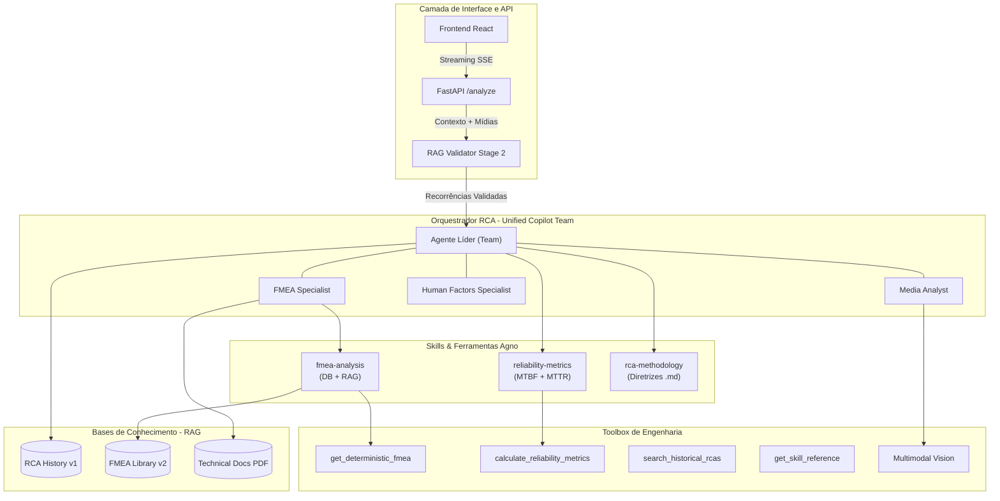

# Arquitetura do AI Service - Orquestração de Especialistas

Esta documentação descreve o funcionamento do módulo de Inteligência Artificial do RCA System após a evolução para um modelo de **Orquestração de Times (Team Orchestration)**. O sistema transcendeu a análise textual simples para se tornar um ecossistema pericial multimodal e orientado por dados de engenharia.

## 🗺️ Mapa do Ecossistema

## 1. Orquestração de Times (agno.team.Team)

O coração da inteligência reside no `main_agent.py`, que agora instancia um `Team` unificado. Diferente de um agente isolado, o Time permite a delegação de tarefas complexas para sub-agentes com instruções especializadas.

### Componentes do Time:
- **Agente Líder (Copiloto):** Coordenador da investigação, responsável pelo diálogo com o usuário e consolidação do Plano de Ação.
- **Media Analyst:** Perito em análise visual (fotos/vídeos) focado em padrões de falha física (corrosão, fadiga, etc).
- **FMEA Specialist:** Analista técnico que cruza o banco de dados determinístico com manuais técnicos (RAG).
- **Human Factors Investigator:** Especialista em causas organizacionais e psicológicas (Metodologia HFACS).

## 2. Inteligência Multimodal

O pipeline agora suporta nativamente a análise de evidências visuais de alta resolução.
- **Processamento:** O `Media Analyst` utiliza o motor **Gemini 2.0 Flash** para interpretar fraturas, desgastes e condições de contorno ambiental diretamente dos anexos da RCA.
- **Contextualização:** O laudo visual é gerado como um insight técnico que o Agente Líder utiliza para validar as causas raízes sugeridas pelo histórico.

## 3. Engenharia de Dados Determinística

O sistema abandonou a dependência exclusiva de busca semântica para integrar métricas e dados estruturados:
- **Confiabilidade:** Cálculo em tempo real de **MTBF** (Mean Time Between Failures), **MTTR** (Mean Time To Repair) e **Disponibilidade Estimada** baseado no histórico validado.
- **FMEA DB:** Consulta direta à tabela `fmea_modes` via API, obtendo o RPN (Risk Priority Number) real e ações recomendadas cadastradas pela engenharia.

## 4. Pipeline de Conhecimento (Triplo RAG)

O sistema gerencia três coleções distintas no VectorDB (ChromaDB):
1. **RCA History:** Memória coletiva de investigações passadas.
2. **FMEA Library:** Manuais internos em formato Markdown.
3. **Technical Documentation:** (Novo!) Indexação de manuais de fabricantes e laudos periciais externos em **PDF**.

## 5. Fluxo de Execução (/analyze)

1. **Injeção de Contexto:** O endpoint captura dados da tela e anexos.
2. **Triagem (RAG Validator):** Um agente de triagem valida quais RCAs históricas são realmente recorrências.
3. **Orquestração:** O Time de especialistas é acionado. O Líder decide se precisa consultar o FMEA, calcular métricas ou pedir um laudo visual das mídias.
4. **Streaming SSE:** A resposta é enviada em tempo real para o Frontend, com mensagens de raciocínio transparentes (ex: "Analisando evidências visuais...").

---
*Atualizado em: 11/03/2026 - Pós-Issue 127*
