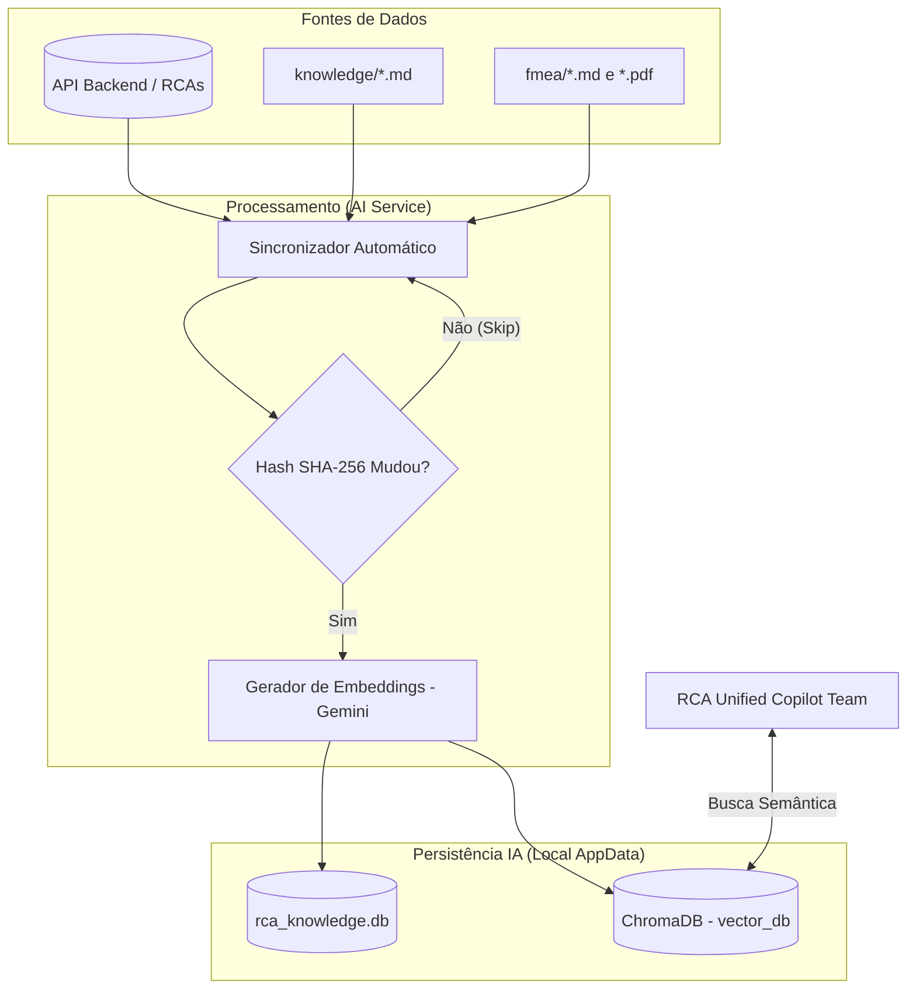

# Estrutura de Dados de Inteligência Artificial (AI Data)

Este documento detalha o propósito e a estrutura dos diretórios de dados que alimentam a Inteligência Artificial e a persistência de longo prazo (RAG e Memória de Agentes) do RCA System.

---

## 1. Visão Geral de Armazenamento

Para evitar problemas de lock de arquivo (ex: OneDrive), os dados dinâmicos da IA são armazenados na pasta de dados do usuário do sistema operacional (ex: `%LOCALAPPDATA%\RCA-System` no Windows), enquanto o conhecimento estático permanece na pasta do projeto.

### 1.1. Conhecimento Estático (Repositório)
| Caminho no Projeto | Tipo | Descrição |
| :--- | :--- | :--- |
| `ai_service/data/knowledge/` | Diretório (MD) | Contém documentações técnicas e metodologias (ex: `rca_methodology.md`). |
| `ai_service/data/fmea/` | Diretório (MD/PDF)| Biblioteca técnica de manuais de FMEA e documentação de fabricantes em PDF. |

### 1.2. Bancos de Dados Dinâmicos (Local AppData)
Localizados em: `~/.local/share/RCA-System/` (Linux/Mac) ou `%LOCALAPPDATA%\RCA-System\` (Windows).

| Arquivo/Pasta | Tipo | Descrição |
| :--- | :--- | :--- |
| `vector_db/` | ChromaDB | Banco de dados vetorial de alto desempenho (ChromaDB) com duas coleções: `rca_history_v1` e `technical_knowledge_v1`. |
| `rca_knowledge.db` | SQLite | Controle de hashes de indexação para economia de tokens API e salvamento de análises de recorrência estruturadas. |
| `agent_memory.db` | SQLite | Persistência nativa do framework Agno OS (Histórico de chats, traces, spans e memórias extraídas da sessão). |

---

## 2. Fluxo de Dados da IA (RAG)

O diagrama abaixo ilustra como os dados operacionais e estáticos são processados para alimentar o cérebro da IA.

---

## 3. Detalhamento dos Componentes

### 3.1. Bancos Vetoriais (ChromaDB)
Utiliza o **ChromaDB** equipado com embeddings da IA do Google.
- **`rca_history_v1`:** Indexa relatórios de RCA usando fragmentos extensos (50.000 tokens) para manter todo o contexto operacional agrupado.
- **`technical_knowledge_v1`:** Indexa manuais FMEA em Markdown e PDFs de fabricantes, utilizados na ferramenta `get_asset_fmea_tool`.

### 3.2. Controle e Validação (rca_knowledge.db)
Este banco SQLite é uma peça fundamental para a otimização da IA e persistência de cache:
- **Tabelas `indexed_rcas` e `indexed_tech_knowledge`:** Armazenam os Hashes SHA-256 do conteúdo no momento da última indexação. Se o hash for igual na próxima varredura, a requisição cara para a API do Embedder é evitada.
- **Tabela `recurrence_analysis`:** Salva o resultado final validado da triagem feita pelo agente `RAG_Validator`, possibilitando que a interface consulte as recorrências de forma imediata sem precisar gerar novamente pela IA.

### 3.3. Memória de Conversação (agent_memory.db)
Banco exclusivo do Framework Agno, onde reside as tabelas `agno_sessions` e `agno_memories`. Permite que a IA continue o raciocínio a partir de onde parou mesmo se o aplicativo for reiniciado.

---

## 4. Comparação de Arquitetura

| Característica | Local AppData (IA Data) | server/data (Backend Node) |
| :--- | :--- | :--- |
| **Propósito** | RAG, Vector Search, Memória LLM | Operação, Transação e Cadastros |
| **Tecnologia** | ChromaDB + SQLite (Agno) | SQLite (rca.db) |
| **Acesso** | Python (AI Service) | Node.js (Servidor Principal) |

---

## Documentação Relacionada
- [Modelo de Dados Operacional (Backend)](../database/MODELO_DADOS.md)
- [Arquitetura de Orquestração AI](architecture_orchestration.md)
- [Pipeline de RAG](rag_pipeline.md)