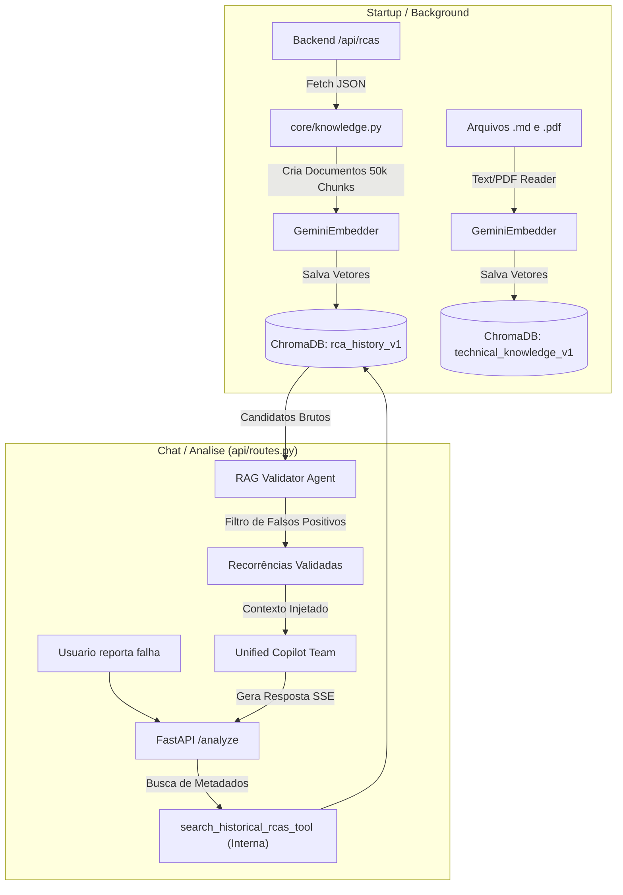
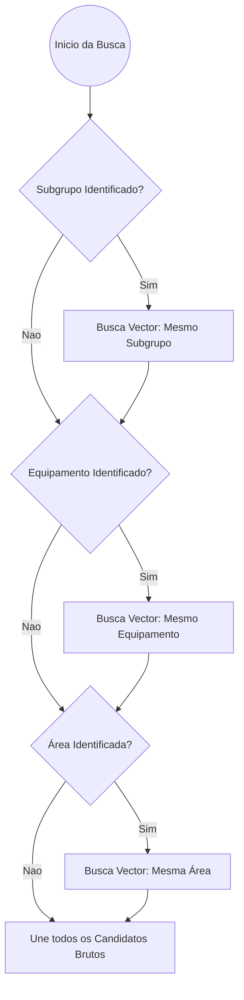

# Pipeline de RAG (Retrieval-Augmented Generation)

O Pipeline de RAG do AI Service permite que o Copiloto identifique incidentes passados e cruze seus padrões de falha com o incidente atual. Ele atua principalmente através do **ChromaDB** integrado à plataforma Agno.

## Arquitetura de Dados

O módulo de busca vetorial utiliza o `ChromaDb` persistente localmente, equipado com `GeminiEmbedder` (gerando embeddings vetoriais via Google GenAI).

### O Fluxo de Ingestão e Consulta

## Sistema de Validação em 2 Estágios (2-Stage RAG)

Para garantir máxima fidelidade na área de engenharia e confiabilidade, as buscas não retornam simplesmente os "Top K" documentos baseados na proximidade de cosseno. Há um segundo estágio de triagem lógica.

### 1. Fallback Hierárquico de Metadados
O sistema busca no banco vetorial respeitando a hierarquia do ativo (Área > Equipamento > Subgrupo), para não misturar falhas de máquinas não relacionadas.

### 2. Validador Semântico (RAG Validator)
Uma vez que os candidatos são retornados pelo VectorDB (ChromaDB), eles são passados para um Agente Efêmero especializado: o **RAG Validator** (`get_rag_validator`). 
Sua única função é aplicar rigor técnico, comparando o incidente da tela com os candidatos brutos, determinando quais são falsos positivos (ex: "vazamento" em bombas diferentes) e quais são **recorrências validadas**.

Apenas as recorrências validadas são disponibilizadas para o cálculo de métricas (MTBF/MTTR) e para a análise do Copiloto.