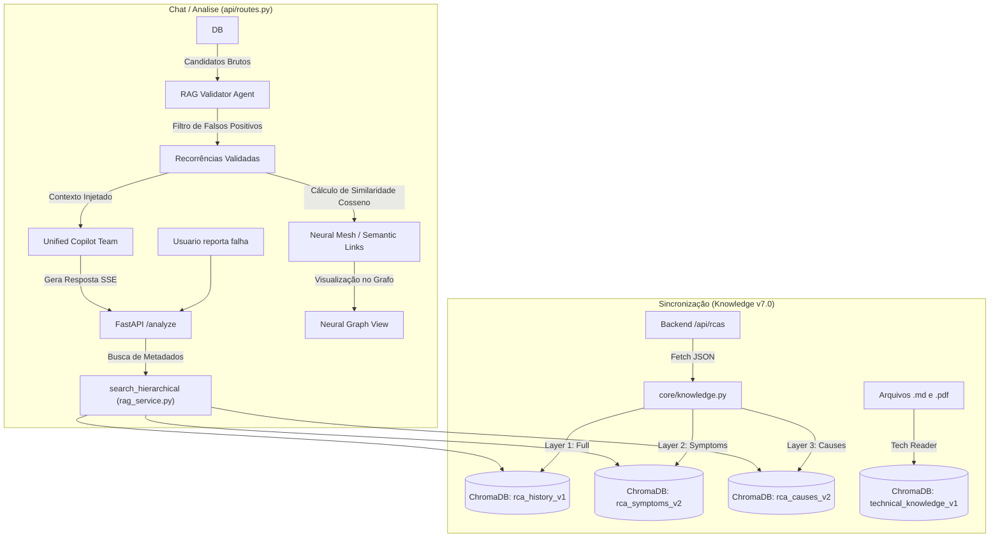
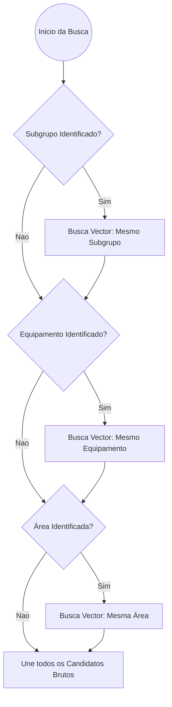

# Pipeline de RAG (Retrieval-Augmented Generation)

O Pipeline de RAG do AI Service permite que o Copiloto identifique incidentes passados e cruze seus padrões de falha com o incidente atual. Ele atua principalmente através do **ChromaDB** integrado à plataforma Agno.

## Arquitetura de Dados

O módulo de busca vetorial utiliza o `ChromaDb` persistente localmente, equipado com `GeminiEmbedder` (gerando embeddings vetoriais via Google GenAI).

### O Fluxo de Ingestão e Consulta

## Sistema de Indexação Multi-Camada (Knowledge v7.0)

A partir da versão v7.0, a indexação de RCAs é dividida em três camadas para otimizar a precisão da recuperação semântica:

1.  **History (Full)**: Indexa o RCA completo (Título, Problema, Investigação, Ações). Ideal para buscas globais e contexto amplo.
2.  **Symptoms (Incident)**: Foca exclusivamente no Título, Problema e Sintomas (Ishikawa). Otimiza a busca quando o usuário reporta apenas "o que está acontecendo".
3.  **Causes (Analysis)**: Indexa as Causas Raiz e a Investigação Técnica. Otimiza a busca por "porquês" técnicos similares.

### Campos Principais de Indexação
Em todas as camadas, os seguintes campos são mandatórios para garantir a precisão:
- **TÍTULO**: Resumo curto da falha (`what`).
- **DESCRIÇÃO DETALHADA**: Contexto detalhado da ocorrência (`problem_description`).
- **HIERARQUIA**: Localização técnica resolvida (Área > Equipamento > Subgrupo).
- **METADADOS**: Especialidade, Categoria, Modo de Falha e Componente (IDs resolvidos para nomes amigáveis).

### Resolução de Taxonomia Amigável
Durante a ingestão, o `knowledge.py` resolve IDs técnicos para nomes legíveis, garantindo que o VectorDB contenha termos humanos:
- **Componentes**: IDs (ex: `CMP-...`) são convertidos para nomes (ex: `Rolo Deflector`) via `taxonomy_component_types`.
- **Ishikawa (6M)**: Categorias como `M1`, `M2` são convertidas para `Mão de Obra`, `Método`, etc., via `taxonomy_root_causes_6m`.

## Estratégias de Busca e Validação

O sistema busca no banco vetorial respeitando a hierarquia do ativo (Área > Equipamento > Subgrupo), para não misturar falhas de máquinas não relacionadas.

### 2. Validador Semântico (RAG Validator)
Uma vez que os candidatos são retornados pelo VectorDB (ChromaDB), eles são passados para um Agente Efêmero especializado: o **RAG Validator** (`get_rag_validator`). 
Sua única função é aplicar rigor técnico, comparando o incidente da tela com os candidatos brutos, determinando quais são falsos positivos (ex: "vazamento" em bombas diferentes) e quais são **recorrências validadas**.

- **Similarity Sharpening**: Aplicação de curva de potência `(1.0 - dist) ** 1.8 * 2.1` para destacar candidatos excelentes.
- **Cross-Domain Validation**: Uso de *few-shot examples* para permitir que o validador reconheça falhas mecânicas idênticas (ex: torque, fixação) mesmo em equipamentos de nomes diferentes.
- **Wide Angle Queries**: Extração cirúrgica de contexto com limite expandido para 2000 caracteres, evitando truncamento de sintomas complexos.

### 3. Malha Neural Semântica (Neural Mesh)
Após a validação, o sistema realiza um terceiro estágio focado na **Interconexão**. Utiliza o algoritmo `calculate_semantic_links` para criar uma rede híbrida de falhas relacionadas.

- **Abordagem Híbrida**: 
    1.  **Match Exato (Causas)**: Interconecta automaticamente falhas que compartilham a mesma string de causa raiz (Score 1.0).
    2.  **Similaridade Vetorial**: Calcula o cosseno entre os embeddings para identificar falhas com o mesmo "DNA" técnico, mesmo com termos diferentes.
- **Conexão Semântica**: Se a similaridade ultrapassar o threshold (**0.88**), um `SemanticLink` é criado.
- **Visualização**: Esses links alimentam a malha de partículas no Grafo Neural no Passo 8 do Wizard, permitindo navegar pela árvore de conhecimento.