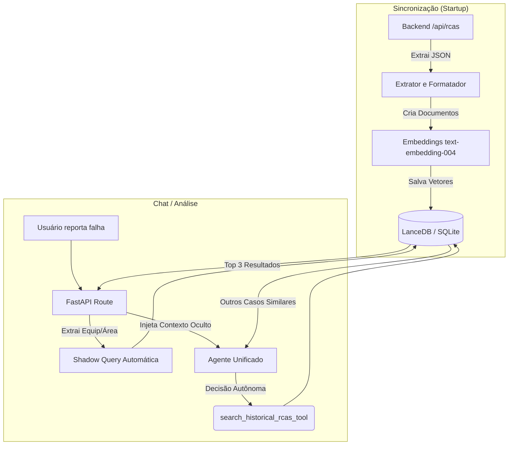
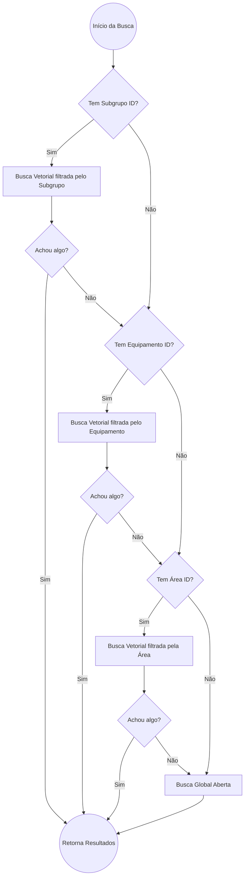

# Pipeline de RAG (Retrieval-Augmented Generation)

O Pipeline de RAG do AI Service permite que o Copiloto identifique incidentes passados e cruze seus padrões de falha com o incidente atual. Ele não gera texto inventado; em vez disso, recupera dados históricos de RCAs (Análise de Causa Raiz) e os injeta no prompt do LLM.

## Arquitetura de Dados

O módulo de busca vetorial utiliza a integração entre o framework Agno e o banco **LanceDB** (`lancedb`), operando em conjunto com embeddings de texto da Google (`text-embedding-004`).

### O Fluxo (Mermaid)



## Como o Agente Localiza Falhas Passadas

O pipeline age em dois momentos distintos para reduzir a latência e aumentar a precisão:

### 1. Injeção Oculta (Shadow Prompting)
Antes mesmo do agente "pensar" sobre a resposta, a rota da API (`api/routes.py`) verifica quais são o `equipment_id` e a `area_id` que estão no relatório da tela. 
Ela realiza uma busca semântica silenciosa no LanceDB baseada na descrição do problema e injeta os 3 incidentes mais similares no contexto do agente sob a tag oculta `[HISTÓRICO ENCONTRADO]`.

### 2. Busca Ativa (Ferramenta `search_historical_rcas_tool`)
Se o usuário fizer perguntas abertas como *"Isso costuma acontecer neste subgrupo?"*, o agente tem autonomia para utilizar a função `search_historical_rcas_tool`.

Esta função foi construída com um sistema de **Fallback Hierárquico de Metadados**:



Esta hierarquia impede que um vazamento de óleo no motor de um Camião seja considerado similar a um vazamento de óleo numa Bomba Hidráulica, restringindo a similaridade vetorial primeiramente aos mesmos ativos, mas escalando geograficamente caso os dados sejam escassos.

## O Formatador de Documentos

No arquivo `ai_service/core/knowledge.py`, os dados estruturados do backend não são passados como JSON direto para a vetorização. O processo transforma chaves (keys) em **texto denso e coeso (chunks)** antes do embedding.

**Exemplo de formatação embutida:**
```text
TÍTULO DA FALHA: Quebra de corrente no módulo 25
ATIVO: 10 - CONVEYOR DE BOBINAS
STATUS: Concluída
DESCRIÇÃO: ...
CAUSAS RAIZ: ...
AÇÕES TOMADAS: ...
```

Isso garante que, quando o modelo de Embeddings procura similaridade espacial, ele encontra a relação de proximidade lógica em linguagem natural.
