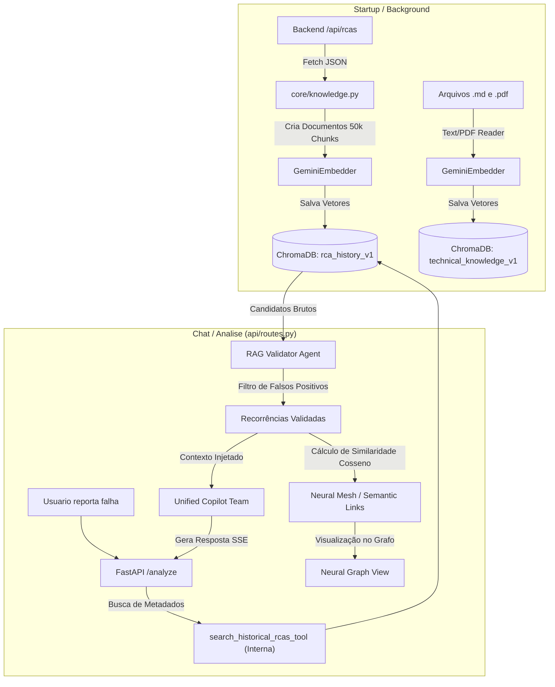
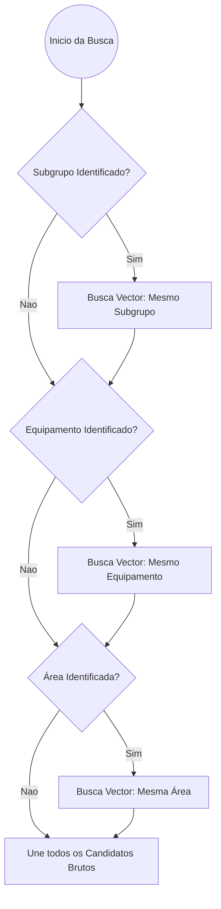

# Pipeline de RAG (Retrieval-Augmented Generation)

O Pipeline de RAG do AI Service permite que o Copiloto identifique incidentes passados e cruze seus padrões de falha com o incidente atual. Ele atua principalmente através do **ChromaDB** integrado à plataforma Agno.

## Arquitetura de Dados

O módulo de busca vetorial utiliza o `ChromaDb` persistente localmente, equipado com `GeminiEmbedder` (gerando embeddings vetoriais via Google GenAI).

### O Fluxo de Ingestão e Consulta

## Sistema de Validação e Interconexão em 3 Estágios (3-Stage RAG)

Para garantir máxima fidelidade na área de engenharia e uma visualização rica de padrões, as buscas não retornam simplesmente os "Top K" documentos. Há um processo de triagem e inteligência relacional.

### 1. Fallback Hierárquico de Metadados
O sistema busca no banco vetorial respeitando a hierarquia do ativo (Área > Equipamento > Subgrupo), para não misturar falhas de máquinas não relacionadas.

### 2. Validador Semântico (RAG Validator)
Uma vez que os candidatos são retornados pelo VectorDB (ChromaDB), eles são passados para um Agente Efêmero especializado: o **RAG Validator** (`get_rag_validator`). 
Sua única função é aplicar rigor técnico, comparando o incidente da tela com os candidatos brutos, determinando quais são falsos positivos (ex: "vazamento" em bombas diferentes) e quais são **recorrências validadas**.

### 3. Malha Neural Semântica (Neural Mesh)
Após a validação, o sistema realiza um terceiro estágio focado na **Interconexão**. Utilizando os mesmos embeddings do Gemini, o `rag_service` calcula a similaridade de cosseno entre todos os pares de recorrências validadas.

- **Conexão Semântica**: Se a similaridade ultrapassar o threshold (0.75), um `SemanticLink` é criado.
- **Diferencial**: Isso permite conectar falhas que possuem causas raízes descritas de forma diferente, mas que possuem o mesmo "DNA" técnico (ex: "vazamento por fadiga" e "trinca por esforço cíclico").
- **Visualização**: Esses links alimentam a malha de partículas no Grafo Neural no Passo 8 do Wizard.
