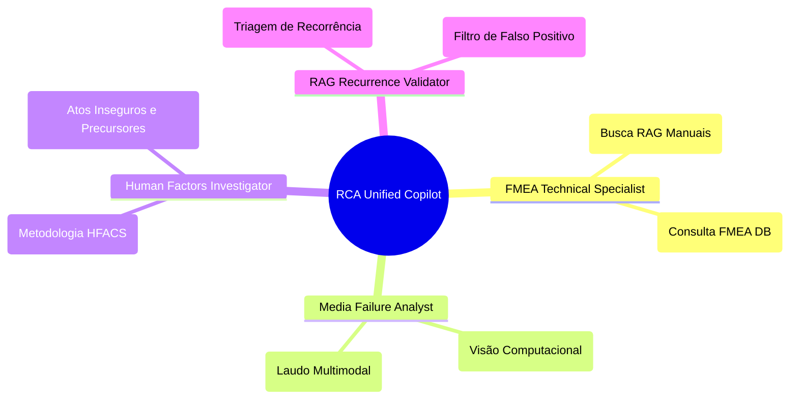

# Agentes Especialistas e Skills (Team Members)

O RCA System utiliza uma arquitetura baseada no `Team` do framework Agno para decompor problemas complexos de engenharia e delegar tarefas para sub-agentes altamente especializados. 

---

## 1. RCA Unified Copilot (`RCA_Unified_Copilot`)
**O Orquestrador Principal.**
- **Papel:** Engenheiro Sênior de Confiabilidade.
- **Função:** Interage com o usuário, extrai o contexto atual da tela, gerencia o histórico de chat e decide quando repassar requisições aos especialistas. Possui acesso direto a todas as habilidades (Skills) metodológicas, pesquisas de internet e métricas.

## 2. Media Failure Analyst (`Media_Failure_Analyst`)
**O Perito em Visão Computacional.**
- **Motor:** Gemini 2.0 Flash (Habilitado para Visão).
- **Missão:** Transformar evidências visuais (fotos e vídeos) em laudos técnicos baseados em evidências físicas, sem subjetividades.
- **Especialidades:**
    - **Padrões de Fratura:** Identificação de falhas dúcteis, frágeis ou fadiga.
    - **Degradação Química:** Detecção de tipos de corrosão.
    - **Sinais Físicos:** Identificação de superaquecimento, falta de lubrificação, vibração (em vídeos) ou desalinhamento visível.

## 3. FMEA Technical Specialist (`FMEA_Technical_Specialist`)
**O Bibliotecário de Engenharia.**
- **Missão:** Cruzar o modo de falha atual com dados históricos e predições teóricas dos manuais FMEA.
- **Capacidades:**
    - Acesso exclusivo ao `technical_knowledge_v1` (ChromaDB com Manuais `.md` e `.pdf`).
    - Ferramenta de busca de dados estruturados e RPN no banco de dados da aplicação (`get_deterministic_fmea_tool`).
- **Output:** Pareceres técnicos indicando se o problema era um risco previsto.

## 4. Human Factors Investigator (`Human_Factors_Investigator`)
**O Especialista em Comportamento.**
- **Missão:** Analisar as quebras da barreira humana e organizacional utilizando o **HFACS** (Human Factors Analysis and Classification System). Foca em corrigir o sistema, não em culpar o indivíduo.
- **Categorias de Análise:** Atos Inseguros, Condições Precursoras, Supervisão Insegura e Influências Organizacionais.

## 5. RAG Recurrence Validator (`RAG_Recurrence_Validator`)
**O Filtro Técnico de Estágio 2.**
- **Missão:** Receber os resultados brutos de similaridade vetorial e descartar os "falsos positivos".
- **Comportamento:** É um agente efêmero (sem memória). Ele julga rigorosamente se dois eventos de falha são funcionalmente e fisicamente similares, assegurando que o cálculo de MTBF e a Causa Raiz sejam baseados apenas em dados verdadeiramente idênticos.

---

## Skills Habilitadas (Agno Skills)
As "Skills" empacotam ferramentas e conhecimento para o Time de Agentes.
1. **`fmea-analysis`**: Traz o ferramental necessário para o FMEA Specialist atuar.
2. **`rca-methodology`**: Fornece referências em Markdown (via `get_skill_reference`) contendo as regras oficiais sobre como montar 5 Porquês, Diagrama de Ishikawa, e Planos de Ação (5W2H).
3. **`reliability-metrics`**: Habilita o cálculo matemático rigoroso de MTBF e MTTR.