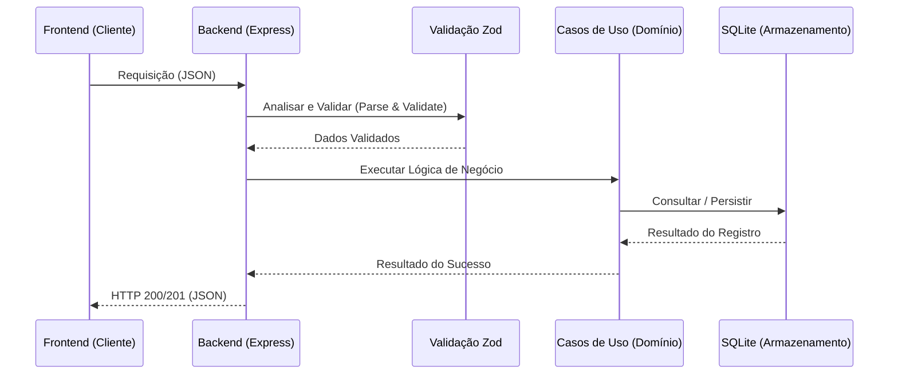

# Referência da API (v2)

Este documento detalha os endpoints da API REST do RCA System, seguindo os padrões de Clean Architecture.

> [!IMPORTANT]
> **Documentação Interativa (Live)**: O Swagger completo do projeto está disponível em [http://127.0.0.1:8000/docs](http://127.0.0.1:8000/docs).



---
A API V2 do RCA System segue o estilo arquitetural RESTful, utilizando JSON como formato padrão para troca de mensagens. Todas as rotas são prefixadas por /api.

### Convenções
- URL Base: http://localhost:3001/api (ambiente de desenvolvimento)
- Autenticação: (Atualmente aberta/interna, futuro suporte a JWT Bearer).
- Datas: ISO 8601 (YYYY-MM-DD ou YYYY-MM-DDTHH:mm:ss.sssZ).
- Paginação: Parâmetros ?page=1&limit=50.
- Status Codes:
    - 200 OK: Sucesso.
    - 201 Created: Recurso criado com sucesso.
    - 400 Bad Request: Erro de validação (Zod) ou requisição mal formatada.
    - 404 Not Found: Recurso não encontrado.
    - 500 Internal Server Error: Erro inesperado do servidor.

---

## 2. Análises e RCA (/rcas)

### Listar Análises
Retorna uma lista paginada ou completa de análises RCA.

GET /rcas

| Parâmetro | Tipo | Obrigatório | Descrição |
| :--- | :--- | :--- | :--- |
| page | number | Não | Número da página (Default: 1). |
| limit | number | Não | Itens por página (Default: 0 - retorna todos). |
| full | boolean | Não | Se true, retorna o objeto completo. Se false, retorna um resumo performático. |

### Obter Análise por ID
Retorna os detalhes completos de uma análise específica.

GET /rcas/:id

### Criar Análise
Cria uma nova análise RCA.

POST /rcas

Body Exemplo (JSON):
```json
{
  "description": "Falha na bomba hidráulica",
  "failure_date": "2026-02-12",
  "status": "IN_PROGRESS",
  "participants": ["João", "Maria"],
  "ishikawa": {
      "machine": [],
      "method": []
  }
}
```
*Nota: O Payload é validado rigorosamente pelo Schema rcaSchema (ver Seção 6).*

### Atualizar Análise
Atualiza uma análise existente. O status pode ser recalculado automaticamente pelo backend dependendo dos campos alterados.

PUT /rcas/:id

Campo Adicional (JSON):
```json
{
  "attachments": [
    { "id": "uuid", "type": "image", "filename": "foto.jpg", "url": "/api/media/rca-id/foto.jpg" }
  ]
}
```

### Importação em Lote (Bulk)
Importa múltiplas análises de uma vez, processando regras de negócio para cada uma.

POST /rcas/bulk

Body: Aceita um Array<RcaRecord> ou um objeto { records: [], actions: [] }.

---

## 3. Gestão de Mídias (/media)

Gerencia o ciclo de vida de arquivos físicos (fotos e vídeos) vinculados às análises.

### Upload de Arquivo
POST /media/upload/:rcaId
- Headers: x-filename (obrigatório), Content-Type.
- Body: Binário bruto (Binary Raw).

### Listar Anexos da RCA
GET /media/rca/:rcaId

### Servir Arquivo
GET /media/:rcaId/:filename

---

## 4. Gatilhos (/triggers)

### Listar Gatilhos
Retorna todos os gatilhos cadastrados.

GET /triggers

### Criar Gatilho
POST /triggers

Body Exemplo (JSON):
```json
{
  "start_date": "2026-02-12T10:00:00",
  "end_date": "2026-02-12T10:30:00",
  "duration_minutes": 30,
  "stop_type": "CORRETIVA",
  "stop_reason": "Quebra mecânica"
}
```

### Importação em Lote
POST /triggers/bulk-import

---

## 5. Planos de Ação (/actions)

### Listar Ações
GET /actions

| Parâmetro | Tipo | Descrição |
| :--- | :--- | :--- |
| rca_id | UUID | (Opcional) Filtra ações vinculadas a uma RCA específica. |

### Criar Ação
Cria uma nova ação corretiva ou preventiva.

POST /actions

Body Exemplo (JSON):
```json
{
  "rca_id": "uuid-1234-5678",
  "action": "Substituir rolamento do eixo principal",
  "responsible": "Equipe Mecânica",
  "date": "2026-02-15",
  "status": "PENDING",
  "moc_number": "MOC-2026-001"
}
```

---

## 6. Ativos e FMEA (/assets e /fmea)

### Obter Árvore de Ativos
Retorna a hierarquia completa de ativos técnicos.

GET /assets/tree

### Gestão de FMEA
- GET /fmea/asset/:assetId: Lista modos de falha do ativo.
- POST /fmea: Cria novo modo de falha.

### Extração de FMEA via IA
POST /v2/fmea/extract-fmea
- **Request Body**: `{ "text": "string", "ui_language": "string" }`
- **Descrição**: Dispara a extração de modos de falha (FMEA) de textos técnicos.
- **Retorno**: Lista estruturada de modos de falha.

### Gestão de Arquivos FMEA
- `GET /v2/fmea/files`: Lista arquivos disponíveis.
- `POST /v2/fmea/upload`: Upload via `multipart/form-data`.
- `DELETE /v2/fmea/files/{filename}`: Remove um arquivo específico.

---

## 8. IA e Recorrências (/v2/recurrence)

Gerencia a busca e análise de recorrências históricas utilizando o pipeline de RAG em 3 estágios.

### Analisar Recorrências (On-Demand)
POST /v2/recurrence
- **Endpoint**: `/v2/recurrence`
- **Descrição**: Realiza busca hierárquica, validação via LLM e cálculo da malha semântica.
- **Request Body (AnalysisRequest)**:
  ```json
  {
    "rca_id": "uuid",
    "area_id": "string (opcional)",
    "equipment_id": "string (opcional)",
    "context": "contexto adicional (opcional)",
    "user_prompt": "prompt customizado (opcional)",
    "stream": false,
    "ui_language": "Português-BR"
  }
  ```
- **Retorno**: `AnalysisResponse` incluindo `subgroup_matches`, `equipment_matches`, `area_matches`, `discarded_matches` e `semantic_links`.

### Obter Análise Salva
GET /v2/recurrence/:rcaId
- **Descrição**: Recupera o último resultado processado para a RCA informada.

---

## 9. Copiloto e Análise de RCA (/v2/analyze)

### Analisar RCA Principal
POST /v2/analyze
- **Descrição**: Executa a análise principal de uma RCA. Suporta streaming de texto (SSE) e injeção de pensamento (reasoning).
- **Request Body**: Mesma estrutura do `AnalysisRequest`.

### Histórico de Conversa
- `GET /v2/analyze/history/{rca_id}`: Recupera histórico de chat.
- `DELETE /v2/analyze/history/{rca_id}`: Limpa histórico da RCA.

---

## 10. Utilitários do Sistema AI

- `GET /health`: Status básico.
- `GET /config`: Configuração atual do Agno OS (modelos e agentes).
- `GET /models`: Lista de modelos de IA configurados.

## 11. Schemas de Validação (Zod)

A integridade dos dados é garantida pela biblioteca Zod. Abaixo, os principais campos validados e seus tipos.

### rcaSchema
| Campo | Tipo | Obrigatório? | Descrição |
| :--- | :--- | :--- | :--- |
| id | UUID | Sim | Gerado automaticamente pelo backend se omitido. |
| analysis_date | DateString | Não | Data da análise. |
| status | String | Sim | Enum: IN_PROGRESS, WAITING_VALIDATION, CONCLUDED. |
| five_whys | JSON | Não | Armazenado na tabela `rca_investigations`. |
| ishikawa | JSON | Não | Armazenado na tabela `rca_investigations`. |
| root_causes | JSON | Não | Armazenado na tabela `rca_investigations`. |
| hra | JSON | Não | Questionário HRA (Passo 9), armazenado na tabela `rca_investigations`. |

### triggerSchema
| Campo | Tipo | Observação |
| :--- | :--- | :--- |
| start_date | DateTime | Pode ser opcional dependendo da configuração. |
| duration_minutes | Number | Obrigatório (Default: 0). |
| stop_type | String | Tipo da parada (ex: Planejada, Corretiva). |

---

## 12. Tratamento de Erros

Em caso de erro de validação (HTTP 400), a API retorna o formato padronizado de erro do Zod, detalhando exatamente qual campo falhou e o motivo.

Exemplo de Resposta de Erro:
```json
{
  "error": "Dados inválidos",
  "details": {
    "status": {
      "_errors": ["O status fornecido não é válido."]
    },
    "duration_minutes": {
      "_errors": ["Expected number, received string"]
    }
  }
}
```
> Nota: Este documento deve ser mantido vivo e atualizado conforme a arquitetura evolui. Qualquer decisão em relação a API e arquitetura deve ser refletida aqui.

---

## Documentação Relacionada
- [Visão Geral do Produto (PRD)](./PRD.md)
- [Arquitetura Técnica](./ARQUITETURA.md)
- [Regras de Negócio](../processes/REGRAS_NEGOCIO.md)
- [Design System](../ux-ui/DESIGN_SYSTEM.md)
- [Guia de Testes](../qa/TESTES.md)
- [Catálogo de Testes](../qa/CATALOGO_TESTES.md)

---

> Nota de Manutenção: Mantenha este documento atualizado. Qualquer alteração na API deve ser refletida aqui e, se impactar a arquitetura, no [ARQUITETURA.md](./ARQUITETURA.md).
