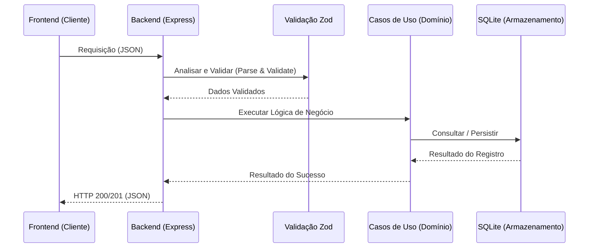

# Referência da API (v2)

Este documento detalha os endpoints da API REST do RCA System, seguindo os padrões de Clean Architecture.



---
A API V2 do RCA System segue o estilo arquitetural **RESTful**, utilizando **JSON** como formato padrão para troca de mensagens. Todas as rotas são prefixadas por `/api`.

### Convenções
- **URL Base:** `http://localhost:3001/api` (ambiente de desenvolvimento)
- **Autenticação:** (Atualmente aberta/interna, futuro suporte a JWT Bearer).
- **Datas:** ISO 8601 (`YYYY-MM-DD` ou `YYYY-MM-DDTHH:mm:ss.sssZ`).
- **Paginação:** Parâmetros `?page=1&limit=50`.
- **Status Codes:**
    - `200 OK`: Sucesso.
    - `201 Created`: Recurso criado com sucesso.
    - `400 Bad Request`: Erro de validação (Zod) ou requisição mal formatada.
    - `404 Not Found`: Recurso não encontrado.
    - `500 Internal Server Error`: Erro inesperado do servidor.

---

## 2. Análises e RCA (`/rcas`)

### Listar Análises
Retorna uma lista paginada ou completa de análises RCA.

**GET** `/rcas`

| Parâmetro | Tipo | Obrigatório | Descrição |
| :--- | :--- | :--- | :--- |
| `page` | `number` | Não | Número da página (Default: 1). |
| `limit` | `number` | Não | Itens por página (Default: 0 - retorna todos). |
| `full` | `boolean` | Não | Se `true`, retorna o objeto completo. Se `false`, retorna um resumo performático. |

### Obter Análise por ID
Retorna os detalhes completos de uma análise específica.

**GET** `/rcas/:id`

### Criar Análise
Cria uma nova análise RCA.

**POST** `/rcas`

**Body Exemplo (JSON):**
```json
{
  "description": "Falha na bomba hidráulica",
  "failure_date": "2026-02-12",
  "status": "IN_PROGRESS",
  "participants": ["João", "Maria"],
  "ishikawa": {
      "machine": [],
      "method": []
  }
}
```
*Nota: O Payload é validado rigorosamente pelo Schema `rcaSchema` (ver Seção 6).*

### Atualizar Análise
Atualiza uma análise existente. O status pode ser recalculado automaticamente pelo backend dependendo dos campos alterados.

**PUT** `/rcas/:id`

### Importação em Lote (Bulk)
Importa múltiplas análises de uma vez, processando regras de negócio para cada uma.

**POST** `/rcas/bulk`

**Body:** Aceita um `Array<RcaRecord>` ou um objeto `{ records: [], actions: [] }`.

---

## 3. Gatilhos (`/triggers`)

### Listar Gatilhos
Retorna todos os gatilhos cadastrados.

**GET** `/triggers`

### Criar Gatilho
**POST** `/triggers`

**Body Exemplo (JSON):**
```json
{
  "start_date": "2026-02-12T10:00:00",
  "end_date": "2026-02-12T10:30:00",
  "duration_minutes": 30,
  "stop_type": "CORRETIVA",
  "stop_reason": "Quebra mecânica"
}
```

### Importação em Lote
**POST** `/triggers/bulk-import`

---

## 4. Planos de Ação (`/actions`)

### Listar Ações
**GET** `/actions`

| Parâmetro | Tipo | Descrição |
| :--- | :--- | :--- |
| `rca_id` | `UUID` | (Opcional) Filtra ações vinculadas a uma RCA específica. |

### Criar Ação
Cria uma nova ação corretiva ou preventiva.

**POST** `/actions`

**Body Exemplo (JSON):**
```json
{
  "rca_id": "uuid-1234-5678",
  "action": "Substituir rolamento do eixo principal",
  "responsible": "Equipe Mecânica",
  "date": "2026-02-15",
  "status": "PENDING",
  "moc_number": "MOC-2026-001"
}
```

---

## 5. Ativos (`/assets`)

### Obter Árvore de Ativos
Retorna a hierarquia completa de ativos técnicos.

**GET** `/assets/tree`

**Resposta:** Estrutura aninhada `Área -> Subgrupo -> Equipamento -> Componente`.

### Obter Lista Plana
Retorna todos os ativos em uma lista plana, ideal para componentes de *Select* ou *Autocomplete*.

**GET** `/assets/flat`

---

## 6. Schemas de Validação (Zod)

A integridade dos dados é garantida pela biblioteca **Zod**. Abaixo, os principais campos validados e seus tipos.

### `rcaSchema`
| Campo | Tipo | Obrigatório? | Descrição |
| :--- | :--- | :--- | :--- |
| `id` | UUID | Sim | Gerado automaticamente pelo backend se omitido. |
| `analysis_date` | DateString | Não | Data da análise. |
| `status` | String | Sim | Enum: `IN_PROGRESS`, `WAITING_VALIDATION`, `CONCLUDED`. |
| `five_whys` | JSON | Não | Array de objetos `{ why: string, answer: string }`. |
| `ishikawa` | JSON | Não | Objeto com arrays de strings para cada um dos 6Ms. |
| `root_causes` | JSON | Não | Array de causas raízes identificadas. |

### `triggerSchema`
| Campo | Tipo | Observação |
| :--- | :--- | :--- |
| `start_date` | DateTime | Pode ser opcional dependendo da configuração. |
| `duration_minutes` | Number | Obrigatório (Default: 0). |
| `stop_type` | String | Tipo da parada (ex: Planejada, Corretiva). |

---

## 7. Tratamento de Erros

Em caso de erro de validação (HTTP 400), a API retorna o formato padronizado de erro do Zod, detalhando exatamente qual campo falhou e o motivo.

**Exemplo de Resposta de Erro:**
```json
{
  "error": "Dados inválidos",
  "details": {
    "status": {
      "_errors": ["O status fornecido não é válido."]
    },
    "duration_minutes": {
      "_errors": ["Expected number, received string"]
    }
  }
}
```
> **Nota:** Este documento deve ser mantido vivo e atualizado conforme a arquitetura evolui. Qualquer decisão em relação a API e arquitetura deve ser refletida aqui.

---

## 📚 Documentação Relacionada
- [Visão Geral do Produto (PRD)](./PRD.md)
- [Arquitetura Técnica](./ARQUITETURA.md)
- [Regras de Negócio](../processes/REGRAS_NEGOCIO.md)
- [Design System](../ux-ui/DESIGN_SYSTEM.md)
- [Guia de Testes](../qa/TESTES.md)
- [Catálogo de Testes](../qa/CATALOGO_TESTES.md)

---

> **Nota de Manutenção:** Mantenha este documento atualizado. Qualquer alteração na API deve ser refletida aqui e, se impactar a arquitetura, no [ARQUITETURA.md](./ARQUITETURA.md).