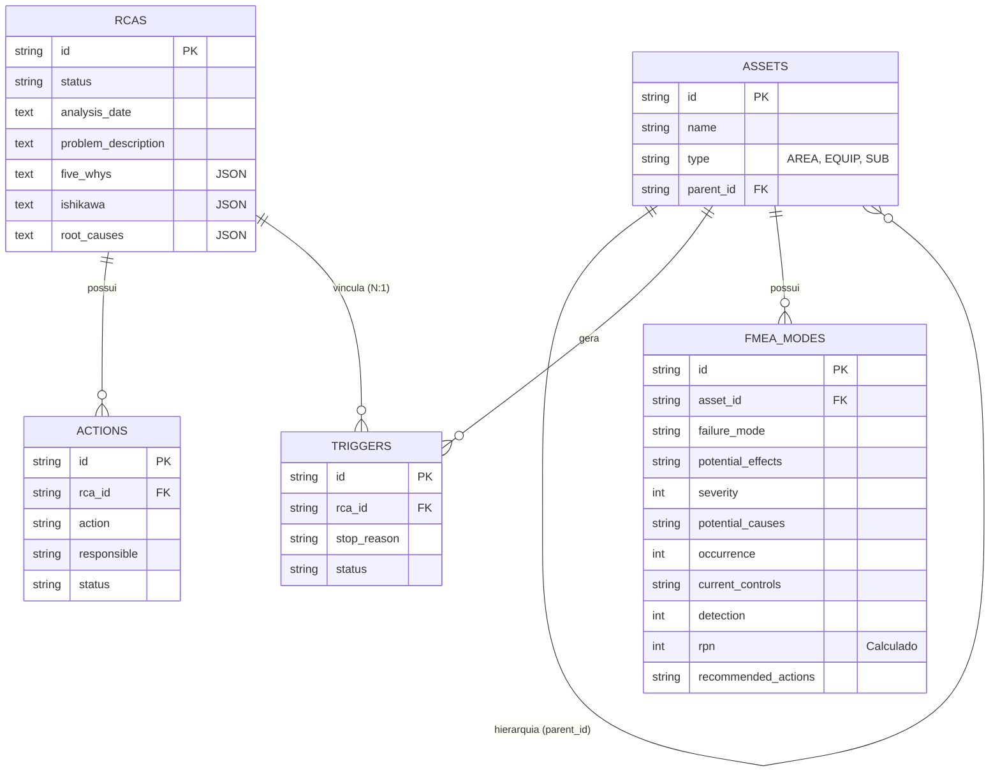

# Modelo de Dados - RCA System

Este documento detalha a estrutura do banco de dados SQLite, cobrindo as entidades operacionais e o módulo de confiabilidade (FMEA).

---

## 1. Arquitetura Relacional

O sistema utiliza um banco de dados **SQLite** local-first. Abaixo está a estrutura das entidades principais conforme o `schema.sql`.

### Diagrama ER (Estado Atual)



### Dicionário de Tabelas

| Tabela | Descrição | Chaves Principais |
| :--- | :--- | :--- |
| `assets` | Hierarquia física (Área > Equipamento > Subgrupo). Utiliza auto-relacionamento (parent_id referenciando id). | `id`, `parent_id` (Self-FK) |
| `rcas` | Registros completos de investigação e análise. | `id` |
| `triggers` | Eventos de parada brutos importados/gerados. | `id`, `rca_id` (FK) |
| `actions` | Planos de ação derivados de uma RCA. | `id`, `rca_id` (FK) |
| `fmea_modes` | Modos de falha e efeitos (FMEA) vinculados a equipamentos. | `id`, `asset_id` (FK) |
| `taxonomy` | Configurações globais de status e campos (JSON). | `id` (PK fixed 1) |

---

## 2. Detalhamento: Tabela fmea_modes

O FMEA é armazenado em uma tabela dedicada para permitir múltiplos modos de falha por equipamento.

| Campo | Tipo | Descrição |
| :--- | :--- | :--- |
| **id** | TEXT (PK) | UUID identificador do modo de falha. |
| **asset_id** | TEXT (FK) | Vínculo com a tabela `assets`. |
| **failure_mode** | TEXT | Descrição do modo de falha (ex: "Travamento de rolamento"). |
| **potential_effects**| TEXT | Efeitos potenciais do modo de falha. |
| **severity** | INTEGER | Nota de Gravidade (1 a 10). |
| **potential_causes** | TEXT | Causas potenciais identificadas para o modo de falha. |
| **occurrence** | INTEGER | Nota de Ocorrência (1 a 10). |
| **current_controls** | TEXT | Controles atuais existentes para prevenir/detectar. |
| **detection** | INTEGER | Nota de Detecção (1 a 10). |
| **rpn** | INTEGER | Risk Priority Number (Calculado automaticamente: S * O * D). |
| **recommended_actions**| TEXT | Ações recomendadas para mitigação do risco. |

### Cálculo de RPN Automático
A coluna `rpn` é uma **Generated Column** persistida no banco (`STORED`). Isso garante que a integridade matemática seja mantida pela engine do SQLite sem necessidade de recálculo manual no backend ou frontend.

---

## 3. Estratégia de Mídias (Issue #2)

Para suportar anexo de imagens e vídeos nas análises, seguiremos a seguinte arquitetura:

### Armazenamento Local-First
- **Pasta de Mídia:** Armazenamento em `/data/media/[rca_id]/`.
- **Referência:** O banco de dados armazenará apenas o caminho relativo ou uma lista de metadados JSON na tabela `rcas`.
- **Limites:**
  - Imagens: Max 5MB (JPG/PNG).
  - Vídeos: Max 50MB (MP4).

### Schema (Extensão)
A tabela `rcas` receberá uma coluna `attachments` (TEXT) contendo um JSON array de objetos:
```json
[
  { "id": "uuid", "type": "image", "path": "filename.jpg", "label": "Evidência 01" }
]
```

---

## Manutenção
Para qualquer alteração no schema físico, consulte o arquivo [schema.sql](../../server/src/v2/infrastructure/database/schema.sql).
