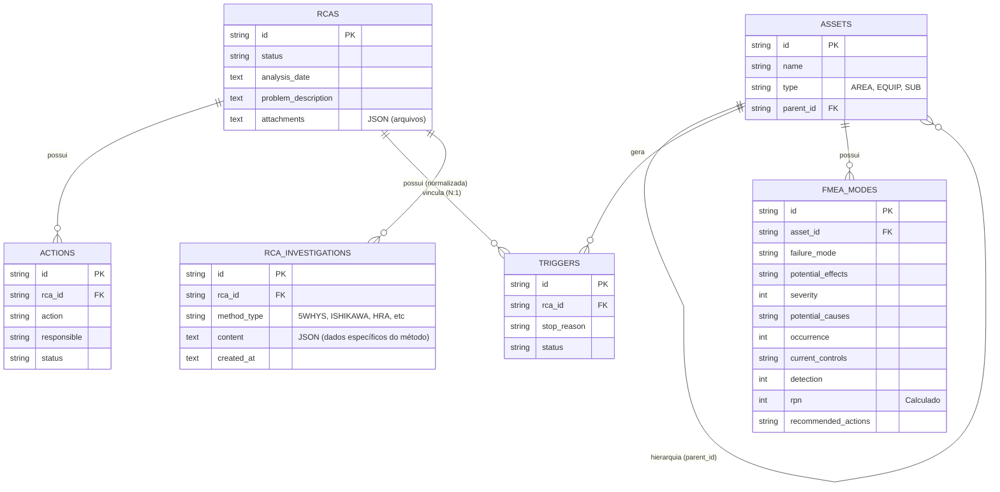

# Modelo de Dados - RCA System

Este documento detalha a estrutura do banco de dados SQLite principal (Backend Node.js), cobrindo as entidades operacionais, e também cita as estruturas auxiliares utilizadas pelo Serviço de Inteligência Artificial.

---

## 1. Arquitetura Relacional Principal (Backend - rca.db)

O sistema utiliza um banco de dados SQLite local-first. Abaixo está a estrutura das entidades principais.

### Diagrama ER

### Dicionário de Tabelas Principais

| Tabela | Descrição | Chaves Principais |
| :--- | :--- | :--- |
| `assets` | Hierarquia física (Área > Equipamento > Subgrupo). Utiliza auto-relacionamento (`parent_id`). | id, parent_id |
| `rcas` | Registros de cabeçalho e dados gerais da RCA. | id |
| `rca_investigations` | Blocos normalizados de investigação (5 Porquês, Ishikawa, HRA, etc). | id, rca_id (FK) |
| `triggers` | Eventos de parada brutos importados/gerados. | id, rca_id (FK) |
| `actions` | Planos de ação derivados de uma RCA. | id, rca_id (FK) |
| `fmea_modes` | Modos de falha e efeitos estruturados vinculados a equipamentos específicos. | id, asset_id (FK) |
| `taxonomy` | Configurações globais de status e campos (JSON). | id (PK fixed 1) |

---

## 2. Detalhamento: Tabela fmea_modes

O FMEA é armazenado em uma tabela dedicada para permitir múltiplos modos de falha por equipamento, sendo consultado diretamente pela ferramenta `get_deterministic_fmea_tool` da IA.

| Campo | Tipo | Descrição |
| :--- | :--- | :--- |
| **id** | TEXT (PK) | UUID identificador do modo de falha. |
| **asset_id** | TEXT (FK) | Vínculo com a tabela assets. |
| **failure_mode** | TEXT | Descrição do modo de falha (ex: "Travamento de rolamento"). |
| **potential_effects**| TEXT | Efeitos potenciais do modo de falha. |
| **severity** | INTEGER | Nota de Gravidade (1 a 10). |
| **potential_causes** | TEXT | Causas potenciais identificadas. |
| **occurrence** | INTEGER | Nota de Ocorrência (1 a 10). |
| **current_controls** | TEXT | Controles atuais existentes. |
| **detection** | INTEGER | Nota de Detecção (1 a 10). |
| **rpn** | INTEGER | Risk Priority Number (Calculado automaticamente: S * O * D). |
| **recommended_actions**| TEXT | Ações recomendadas para mitigação do risco. |

### Cálculo de RPN Automático
A coluna `rpn` é uma **Generated Column** persistida no banco (`STORED`). Isso garante que a integridade matemática seja mantida pela engine do SQLite.

---

## 3. Bancos de Dados Auxiliares de Inteligência Artificial

Para evitar bloqueios (`locks`) e separar a carga de processamento vetorial das transações do backend, a IA gerencia seus próprios bancos de dados isolados, armazenados na pasta local do usuário (`%LOCALAPPDATA%\RCA-System`):

1. **ChromaDB (`vector_db`)**: Armazena as embeddings (vetores) para o Triplo RAG. Possui as coleções `rca_history_v1` e `technical_knowledge_v1`.
2. **`agent_memory.db`**: SQLite gerenciado nativamente pelo framework Agno OS para persistir o histórico de conversas dos agentes, sessões (`agno_sessions`) e memórias ativas (`agno_memories`).
3. **`rca_knowledge.db`**: SQLite gerencial da IA contendo as tabelas `indexed_rcas`, `indexed_tech_knowledge` (para controle de hash e evitar indexações desnecessárias) e `recurrence_analysis` (para salvar resultados validados do RAG).

---

## Documentação Relacionada
- [Arquitetura de Dados de IA (Vector DB / Memória)](../ai/data_architecture.md)