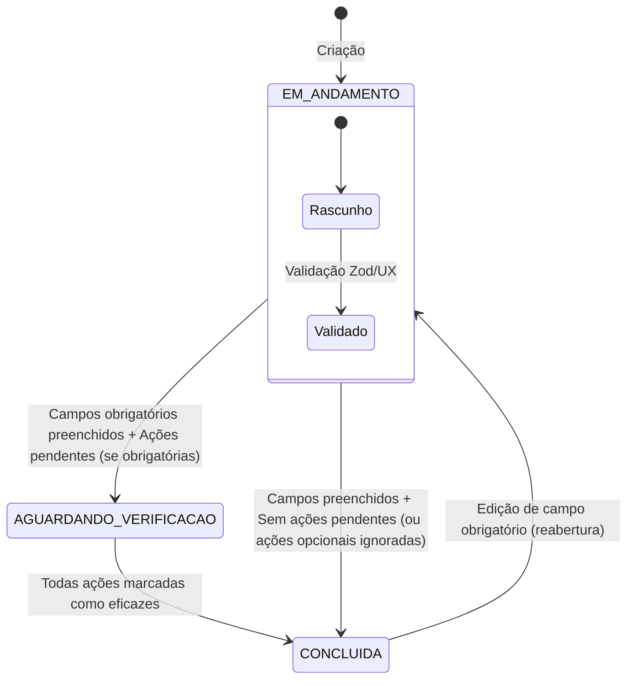
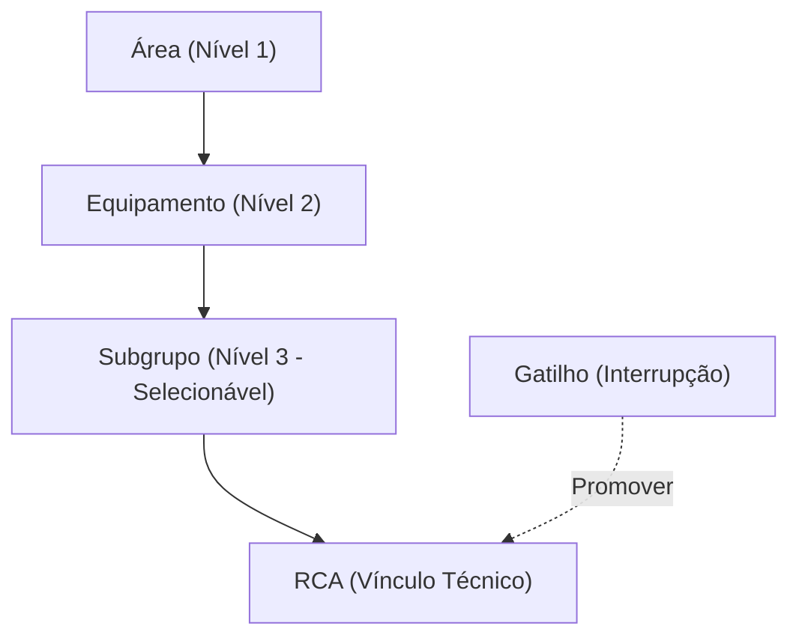

# Regras de Negócio - RCA System

Este documento descreve as regras de negócio centrais que governam o comportamento do RCA System.

> **Objetivo de Governança:** Diferente de planilhas Excel onde "tudo é aceito", este sistema impõe regras rígidas de validação para garantir a padronização regional e a integridade dos KPIs.

---

## Ciclo de Vida da RCA

A Análise de Causa Raiz (RCA) é a entidade principal do sistema. Seu ciclo de vida é gerido automaticamente com base no preenchimento de dados e na eficácia das ações.

### 1. Criação
- **ID:** Gerado automaticamente (UUID) se não fornecido.
- **Status Inicial:** Sempre inicia como `Em Andamento` (IN_PROGRESS).
- **Versão:** Define a versão do formulário utilizada (ex: `17.2`).
    - Data da falha.

### 2. Edição e Segurança de Dados
- **Guarda de Navegação:** O sistema impede a mudança acidental de página (via Sidebar) enquanto o Editor de RCA estiver aberto. O usuário deve confirmar que deseja sair, sob risco de perda de alterações não salvas.

### 3. Cálculo Automático de Status
O sistema recalcula o status da RCA a cada salvamento ou alteração em suas Ações vinculadas, baseando-se na configuração de obrigatoriedade definida para o tipo de falha.

| Status | Regra de Negócio |
| :--- | :--- |
| **Em Andamento** | Estado padrão. Mantido enquanto **qualquer** campo obrigatório estiver vazio OU se houver erros de validação. |
| **Aguardando Verificação** | Todos os campos obrigatórios preenchidos, MAS possui **ações configuradas como obrigatórias** que ainda não foram marcadas como eficazes. |
| **Concluída** | 1. Todos os campos obrigatórios preenchidos. 2. Se houver ações obrigatórias, todas devem ser eficazes. 3. Se as ações não forem obrigatórias, a RCA conclui ignorando o estado das ações. |

> **Nota:** O sistema impede a conclusão manual se as regras acima não forem satisfeitas.

### 3. Campos Obrigatórios (Taxonomia)
A obrigatoriedade dos campos é dinâmica e configurável via `TaxonomyService`.
- **Regra de Criação:** Campos mínimos para salvar um rascunho (ex: `what`, `asset`).
- **Regra de Conclusão:** Lista estrita de campos para finalizar (ex: `root_causes`, `five_whys`, `ishikawa`, `actions`).
- **Validação:** Realizada tanto no Frontend (UX feedback) quanto no Backend (Integridade).

---

## Identificação e Validação de Recorrências (RAG)

O sistema utiliza Inteligência Artificial para identificar se a falha atual já ocorreu anteriormente através do pipeline de RAG (Estágio 2).

### 1. Critérios de Recorrência
- **Escalabilidade Hierárquica**: A busca prioriza a mesma Área, Equipamento ou Subgrupo para garantir contexto técnico.
- **Similarity Sharpening**: O sistema aplica uma curva de potência aos scores de similaridade para destacar padrões idênticos e atenuar ruídos semânticos.
- **Validação Transversal**: Se o mecanismo de falha for idêntico (ex: torque insuficiente, vibração excessiva), o sistema deve validar a recorrência mesmo que o nome do componente seja diferente (ex: Motor A vs Motor B).

### 2. Visibilidade de Padrões
- **Neural Mesh**: Conexões semânticas (Similaridade > 0.75) são geradas automaticamente para alimentar o grafo de recorrências no Passo 8, evidenciando o "DNA" da falha.

---

## Regras de Gatilhos (Triggers)

Os gatilhos representam eventos de parada que podem ou não virar uma RCA.
- **Conversão/Vínculo:** Um ou mais gatilhos podem ser vinculados a uma única RCA. Isso permite que falhas recorrentes em um curto período sejam tratadas em uma análise unificada.
- **Relacionamento:** A estrutura de dados suporta **N:1** (Múltiplos Triggers para 1 RCA).

---

## Planos de Ação

Ações Corretivas e Preventivas vinculadas a uma RCA.
- **Recálculo em Cascata:** Criar, editar ou excluir uma ação dispara imediatamente o recálculo do status da RCA pai (`RcaService.updateRca`).
- **Eficácia:** Uma ação só é considerada eficaz se o status for `Concluída` ou `Eficaz` (IDs 3 ou 4).

---

## Integridade de Dados e Migração

O `RcaService` implementa normalizadores (`migrateRcaData`) para garantir que dados legados não quebrem a aplicação:
- **5 Porquês:** Garante array mínimo de 5 posições.
- **Ishikawa:** Garante a estrutura dos 6M (`machine`, `method`, etc).
- **Causa Raiz:** Converte string simples (legado) para array de objetos `root_causes`.
- **Sincronização de Ativos:** Novos ativos detectados na importação são criados em camadas (Área -> Equipamento -> Subgrupo) para garantir que o vínculo de `parent_id` seja sempre válido.

---

## 📚 Documentação Relacionada
- [PRD - Requisitos](../core/PRD.md)
- [Referência da API](../core/REFERENCIA_API.md)

---

> **Nota de Manutenção:** Mantenha este documento atualizado. Alterações nas regras de negócio devem ser sincronizadas com os testes em [CATALOGO_TESTES.md](../qa/CATALOGO_TESTES.md).
- [Catálogo de Testes](../qa/CATALOGO_TESTES.md)
- [Arquitetura Técnica](../core/ARQUITETURA.md)
