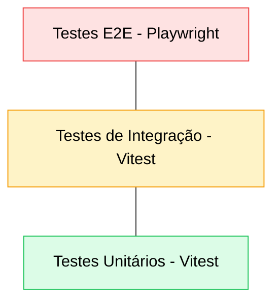
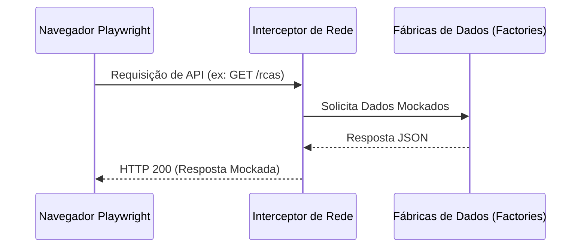

# Estratégia e Procedimentos de Testes - RCA System

Este documento detalha a arquitetura de testes, as ferramentas utilizadas e os procedimentos obrigatórios para garantir a qualidade e estabilidade do RCA System.

---

## 1. Pirâmide de Testes

O projeto segue uma estrutura de testes dividida em três camadas principais:



### 1.1. Testes Unitários e Funcionais de IA (Python/pytest)
- **Escopo:** Lógica do Agente Detective, ferramentas de consulta (tools) e endpoints da API FastAPI.
- **Localização:** `ai_service/tests/*.py`
- **Ferramenta:** Pytest com mocks de rede (httpx) e objetos de IA (Agno).

### 1.2. Testes Unitários (Vitest)
- **Escopo:** Funções puras, hooks do React e lógica de domínio isolada.
- **Localização:** 
  - Frontend: `src/**/__tests__/*.test.ts(x)`
  - Backend: `server/src/**/__tests__/*.test.ts`
- **Ferramenta:** Vitest com JSDOM para simulação de ambiente de navegador no frontend.

### 1.3. Testes de Integração (Vitest)
- **Escopo:** Validação da interação entre serviços, repositórios e banco de dados SQLite.
- **Localização:** `server/src/v2/__tests__/*.test.ts`
- **Ferramenta:** Vitest executando contra um banco de dados de teste (`rca_test.db`).

### 1.4. Testes de Ponta a Ponta - E2E (Playwright)
- **Escopo:** Fluxos completos de usuário, validação de interface e integração total (com mocks de API).
- **Localização:** `tests/e2e/*.spec.ts`
- **Ferramenta:** Playwright.

### 1.5. Testes de Hooks e Utilitários de Domínio (Vitest)
- **Escopo:** Validação isolada de lógicas complexas de data, parsing de arquivos Excel, filtragem cruzada dinâmica e orquestração de formulários no Frontend.
- **Localização:** 
  - `src/hooks/__tests__/*.test.ts(x)`
  - `src/utils/__tests__/*.test.ts(x)`
- **Ferramenta:** Vitest com `@testing-library/react` (método `renderHook`).

### 1.6. Análise Estática AST (via Playwright)
- **Escopo:** Verificação de vazamentos de Internacionalização (I18N) em tempo de execução através do DOM.
- **Localização:** `tests/e2e/rca-i18n.spec.ts`
- **Ferramenta:** Playwright executando crawler no frontend.

### 1.7. Auditoria Estática de I18N (Vitest)
- **Escopo:** Varredura rigorosa do código-fonte para detectar:
  1. Strings "hardcoded" em tags JSX.
  2. Texto puro em atributos (placeholder, title, label).
  3. Chaves usadas via `t()` que não existem nos dicionários PT/EN.
- **Localização:** `src/services/__tests__/i18n-audit.test.ts`
- **Ferramenta:** Vitest com Regex e análise de dicionários estáticos.

---

## 2. Execução via CLI

### 2.1. Executar Testes do Serviço de IA (Python)
```bash
pytest ai_service/tests
```

### 2.2. Executar Testes do Frontend (Raiz)
```bash
npx vitest run
```

### 2.3. Executar Testes do Backend
```bash
npm test --prefix server
```

### 2.4. Executar Testes E2E
```bash
npx playwright test
```
Para abrir a interface visual do Playwright:
```bash
npx playwright test --ui
```

---

## 3. Guia de Mocking e Dados de Teste

### 3.1. Mocking no Frontend (E2E)
Seguimos o padrão de **API Shadowing**. Nunca dependemos do backend real para testes funcionais de UI. O isolamento deve ser feito no `beforeEach`:

```typescript
await page.route('**/api/**', async route => {
  // Retorne dados controlados via Factories
});
```



### 3.2. Uso de Factories
Utilizamos fábricas de dados para garantir que os objetos de teste sejam consistentes e completos.
- **Referência:** `tests/factories/rcaFactory.ts`
- **Regra:** Nunca utilize objetos literais incompletos; use sempre as factories para evitar erros de runtime (Blank Screens).

### 3.3. Regressão Visual (Snapshots)
O projeto possui suporte inicial para snapshots visuais através do Playwright.
- **Implementação:** O método `takeSnapshot(name)` está disponível no `RcaEditorPage`.
- **Status Atual:** Desabilitado por padrão no ambiente de Integração Contínua (CI) para evitar falso-positivos por renderização de fontes.
- **Uso Local:** Pode ser habilitado em arquivos `.spec.ts` para validar mudanças complexas de layout.

---

## 4. Guia de Maturidade e Resolução de Problemas (Knowledge Base)

Este capítulo consolida as soluções para os desafios técnicos enfrentados na automação do projeto.

### 4.1. O Fenômeno da Tela Branca (Blank Screen)
Durante a execução de testes no modo visível, a interface pode travar ou ficar branca devido a:
1. **Conflito de Virtualização:** O container pai deve ter dimensões fixas.
2. **Velocidade de Mocks:** Mocks respondendo em 0ms podem quebrar a hidratação do React.
3. **Dados Incompletos:** Filtros falham se propriedades da taxonomia forem `undefined`.

**Solução Padrão:**
- Viewport estático de 1280x720 no `playwright.config.ts`.
- Aguardar o desaparecimento de `data-testid="app-suspense-loading"`.
- **Sincronização de Overlay**: Aguardar explicitamente `data-testid="rca-editor-overlay"` para garantir que o React montou o portal de edição.
- Garantir mocks completos via Factories.

### 4.2. Instabilidade do DOM (Element Detachment)
Re-renderizações agressivas podem fazer com que o Playwright perca a referência de elementos.
- **Estratégia:** Aguardar estado `networkidle` e visibilidade de containers principais antes de interagir.
- **Page Object Model (POM):** Centralizar seletores em `tests/pages/`.

### 4.3. Intercepção de Ponteiro e Modals (Z-Index)
Inputs invisíveis ou elementos de fundo podem bloquear cliques.
- **Estrutura Overlay**: O editor utiliza `z-50` e container `fixed` para isolamento total.
- **Bloqueio de Sidebar**: Quando o editor está aberto, a Sidebar é bloqueada (`isBlocked`) para evitar hovers acidentais que disparam o `NavigationGuard`.
- **Workaround**: Utilizar `{ force: true }` apenas se ajustes de Z-Index falharem.

### 4.4. Sincronização de Fechamento (Race Conditions)
O Playwright pode tentar interagir com a lista antes que o estado do React "limpe" o editor.
- **Page Object Model (POM)**: O método `saveAndClose()` deve aguardar que o overlay perca a visibilidade (`expect(overlay).not.toBeVisible()`) e incluir um pequeno timeout de segurança (ex: 500ms) para refletir o `refreshAll`.
- **Estado Mandatório**: Garantir que as regras de taxonomia (campos `rca.conclude`) sejam preenchidas no teste, permitindo que a lógica de salvamento ocorra com sucesso e feche o modal.

### 4.5. Testes de Desempenho Front-end (Stress Testing)
Para testar o comportamento do aplicativo sob carga volumosa de dados, é mais eficiente injetar artificialmente grandes massas de registros no navegador do que depender de chamadas com rede real.
- **Injeção de LocalStorage**: Use `page.evaluate()` para depositar os registros de mock na chave do `localStorage` correta antes do recarregamento da página (e.g., `rca_app_v1_records`).
- **Timeouts Customizados**: Ao envolver testes com renderização pesada (1000+ componentes na DOM), configure explicitamente `expect(elemento).toBeVisible({ timeout: 15000 })` e não dependa exclusivamente do timeout padrão do Playwright.

### 4.6. Teste de Traduções Rigorosas (I18N Leaks)
Para testar profundamente a internacionalização, criei um *Crawler* que inspeciona o `innerText` global da tela principal, assegurando-se de que nada vazou à conversão.
- Busque por chaves de objetos cruas e palavras soltas `hardcoded`, configurando `expect(leaks).toHaveLength(0)`.
- Use a função `t('chave', 'Fallback em inglês')` inclusive dentro das propriedades dos seus componentes, e confira o idioma do projeto no setup geral.

### 4.7. Auditoria Estática de Código (Pre-commit)
Para evitar que novas strings hardcoded entrem no repositório, utilizamos uma auditoria baseada em Regex que varre todos os componentes.
- **Vantagem:** Muito mais rápido que o crawler do Playwright, pois não requer renderização.
- **Regra de Ouro:** Se o teste falhar, você DEVE mover a string para os arquivos `pt.ts` e `en.ts` e usar o hook `useLanguage`.
- **Exceções:** Linhas que contêm template literals `${...}` ou comentários são ignoradas para evitar falso-positivos de chaves dinâmicas.

---

## 5. Protocolo de Criação de Novos Testes

1. **Page Objects e Test IDs:** Nunca use seletores CSS diretos ou fracos (ex: `page.locator('select')`) nos arquivos `.spec.ts`. Use atributos `data-testid` (ex: `page.getByTestId('meu-elemento')`) para interagir com a aplicação ou as classes em `tests/pages/`, tornando os testes imunes a mudanças visuais de classe e estrutura HTML.
2. **Navegação Consistente:** Não utilize URLs "hardcoded" exclusivas para o host local nos scripts (`page.goto('http://localhost:3000')`). Sempre dependa da infraestrutura de BaseURL configurada no Playwright via rotas relativas (e.g. `page.goto('/')`).
3. **Monitoramento:** Ative a captura de erros de console (`page.on('pageerror', ...)`) para diagnosticar falhas.
3. **Bilíngue (i18n):** Use Regex para busca de botões (ex: `/Salvar|Save/i`).
4. **Idioma e Padrão:**
   - Todos os comentários e nomes de testes devem ser em **Português (PT-BR)**.
   - Proibido o uso de emojis em descrições técnicas.
   - Manter o cabeçalho detalhando: Proposta, Ações, Execução e Fluxo.

---

## 6. Configuração do Ambiente

1. Certifique-se de que as dependências estão instaladas: `npm install` e `npm install --prefix server`.
2. Instale os navegadores do Playwright: `npx playwright install`.
3. O frontend deve estar configurado para rodar na porta 3000 durante os testes E2E locais (conforme `playwright.config.ts`).

---

> **Nota:** Este documento deve ser mantido vivo e atualizado conforme a arquitetura evolui. Qualquer decisão em relação a testes e automação deve ser refletida aqui.

---

## 📚 Documentação Relacionada
- [Visão Geral do Produto (PRD)](../core/PRD.md)
- [Arquitetura Técnica](../core/ARQUITETURA.md)
- [Referência da API](../core/REFERENCIA_API.md)
- [Diretrizes de Código](../core/DIRETRIZES_CODIGO.md)
- [Design System](../ux-ui/DESIGN_SYSTEM.md)
- [Catálogo de Testes](./CATALOGO_TESTES.md)
- [PRD - Requisitos](../core/PRD.md)

---

> **Nota de Manutenção:** Mantenha este documento atualizado. Ajustes na estratégia de testes devem ser refletidos no [CATALOGO_TESTES.md](./CATALOGO_TESTES.md).
