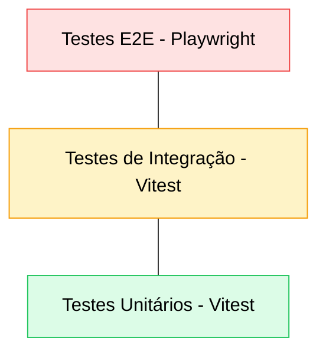
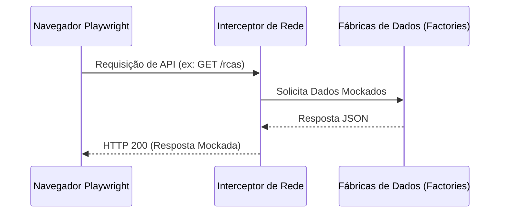

# Estratégia e Procedimentos de Testes - RCA System

Este documento detalha a arquitetura de testes, as ferramentas utilizadas e os procedimentos obrigatórios para garantir a qualidade e estabilidade do RCA System.

---

## 1. Pirâmide de Testes

O projeto segue uma estrutura de testes dividida em três camadas principais:



### 1.1. Testes Unitários e Funcionais de IA (Python/pytest)
- **Escopo:** Lógica do Agente Unificado, extração de FMEA, processamento de mídias e endpoints da API FastAPI.
- **Localização:** `ai_service/tests/*.py`
- **Ferramenta:** Pytest com mocks de rede (httpx) e objetos de IA (Agno).
- **Destaque:** O arquivo `test_multimodal.py` valida o fluxo completo de download e análise de evidências visuais.

### 1.2. Testes Unitários (Vitest)
- **Escopo:** Funções puras, hooks do React e lógica de domínio isolada.
- **Localização:** 
  - Frontend: `src/**/__tests__/*.test.ts(x)`
  - Backend: `server/src/**/__tests__/*.test.ts`
- **Ferramenta:** Vitest com JSDOM para simulação de ambiente de navegador no frontend.
- **Métrica Alvo:** Cobertura de branches > 80% em contextos críticos (ex: RcaContext).

### 1.3. Testes de Integração (Vitest)
- **Escopo:** Validação da interação entre serviços, repositórios e banco de dados SQLite.
- **Localização:** `server/src/v2/__tests__/*.test.ts`
- **Ferramenta:** Vitest executando contra um banco de dados de teste (`rca_test.db`).

### 1.4. Testes de Ponta a Ponta - E2E (Playwright)
- **Escopo:** Fluxos completos de usuário, validação de interface e integração total (com mocks de API).
- **Localização:** `tests/e2e/*.spec.ts`
- **Ferramenta:** Playwright.

---

## 2. Execução via CLI

### 2.1. Executar Testes do Serviço de IA (Python)
```bash
pytest ai_service/tests
```

### 2.2. Executar Testes do Frontend (Raiz)
```bash
npx vitest run
```

### 2.3. Executar Testes do Backend
```bash
npm test --prefix server
```

### 2.4. Executar Testes E2E
```bash
npx playwright test
```

---

## 3. Guia de Mocking e Dados de Teste

### 3.1. Mocking no Frontend (E2E)
Seguimos o padrão de API Shadowing. Nunca dependemos do backend real para testes funcionais de UI. O isolamento deve ser feito no `beforeEach`.



---

## 4. Maturidade e Resolução de Problemas

### 4.1. Sincronização de Schema em Testes
Ao adicionar colunas no banco de dados (ex: `attachments`), é obrigatório atualizar os scripts de criação de tabelas temporárias nos arquivos `beforeEach` dos testes de integração do backend para evitar erros de `no column named`.

### 4.2. Auditoria de Internacionalização
O comando `npx vitest run src/services/__tests__/i18n-audit.test.ts` deve ser executado para garantir que nenhuma nova funcionalidade (ex: Media Manager) contenha textos hardcoded.

---

## 5. Protocolo de Criação de Novos Testes

1. **Page Objects e Test IDs:** Use atributos `data-testid` para interagir com a aplicação, tornando os testes imunes a mudanças visuais de classe e estrutura HTML.
2. **Idioma e Padrão:** Todos os comentários e nomes de testes devem ser em Português (PT-BR). Proibido o uso de emojis em descrições técnicas.

---

## Documentação Relacionada
- [PRD - Requisitos](../core/PRD.md)
- [Diretrizes de Código](../core/DIRETRIZES_CODIGO.md)
- [Catálogo de Testes](./CATALOGO_TESTES.md)
